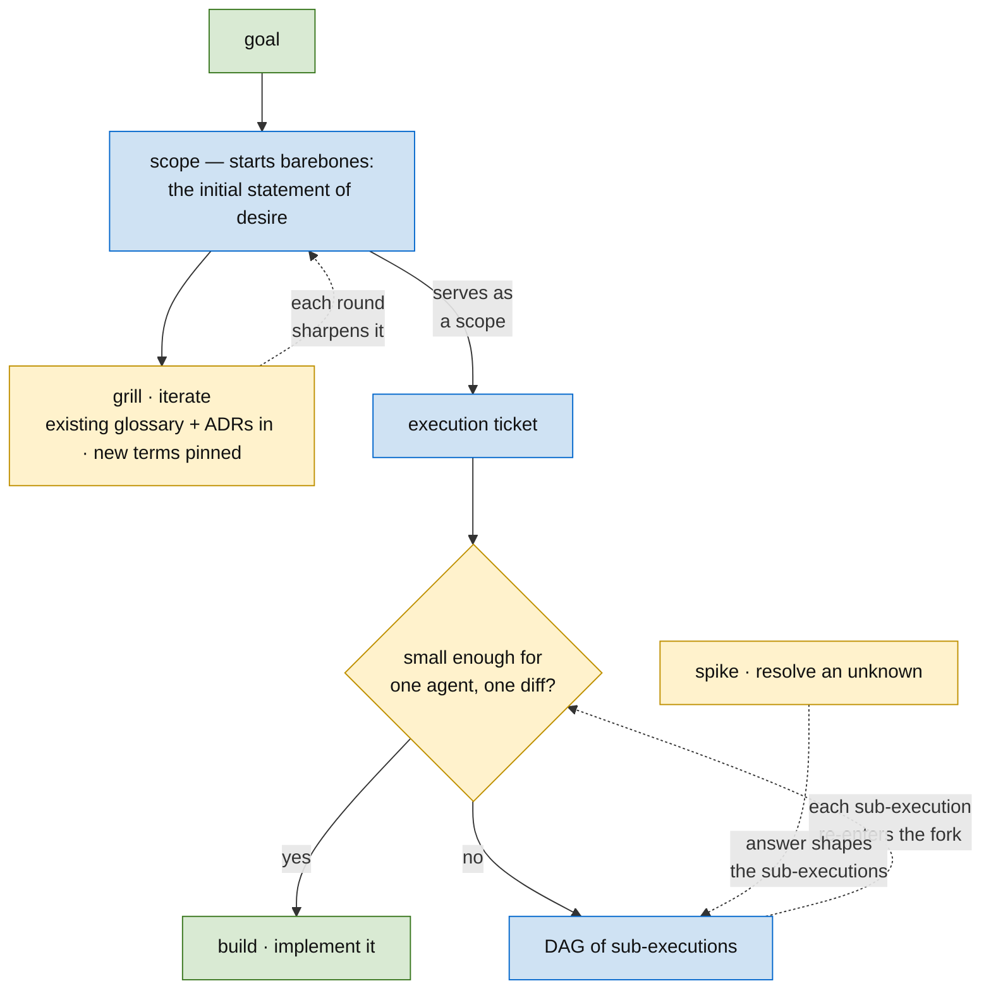
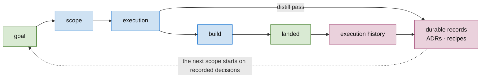

# skills

**Turn a goal into shipped code through small, verifiable steps** — the human decides at the forks, the agent executes, the ticket is the interface.

The method from a human's seat: start with the **barebones scope** — the initial statement of desire — and **iterate it by grilling** against the durable records prior work left (the glossary, the ADRs), pinning the new language it invents, until it **serves as a scope**. Then write **one execution ticket**, and a single fork decides everything — *small enough for one agent in one diff?* If yes, **build** it; if no, it's a **DAG of sub-executions** that each re-enter the fork. **Spikes** answer the unknowns that shape them.

And it feeds itself: the execution records *how the work actually went* — the wrong turns and their fixes — and a **distill pass** (mid-execution, and always before concluding complete) turns that into **durable records**: ADRs ("why it's this way") and recipes ("how we do X here") the next scope consumes, so the next agent skips the lesson.

Each part is governed by one named practice:

- **Plan the work** — [methodology](skills/methodology/SKILL.md) (the map) · [grill](skills/grill/SKILL.md) (iterate the scope until it serves; sharpen the language) · [planning](skills/planning/SKILL.md) (goal → DAG) · [ticketing](skills/ticketing/SKILL.md) (one unit of work)
- **Build it** — [building](skills/building/SKILL.md) (ratified ticket → landed PR; worktree discipline, the branch tree mirrors the DAG)
- **Draw it clearly** — [diagramming](skills/diagramming/SKILL.md) (a picture beats prose)
- **Type the contracts** — [strong-typing](skills/strong-typing/SKILL.md) · [capability-types](skills/capability-types/SKILL.md) (the compiler checks the edges)
- **Pick up & review** — [orient](skills/orient/SKILL.md) (start cold, review against live state)
- **Close the loop** — [recipe](skills/recipe/SKILL.md) (distill a finished execution into a reusable "how we do X here")

*House-style methodology skills for agentic, multi-session software work — self-contained, per [`AGENTS.md`](AGENTS.md). The table below is the detailed reference.*

## Skills

| Skill | Produces | Use when |
|---|---|---|
| [methodology](skills/methodology/SKILL.md) | Orientation on the whole operating shape — goal → milestone → scope → execution DAG → spikes → builds, and which sub-skill governs each step | Starting or re-orienting on any planned effort; deciding which discipline applies |
| [grill](skills/grill/SKILL.md) | A scope that serves — iterated from the barebones statement of desire — plus glossary entries (`CONTEXT.md`), live ADRs, and spike tickets for what nobody could answer | Iterating every scope with the human, one recommended-answer question at a time (the existing glossary + ADRs are the rubric); also before decomposing a big execution |
| [planning](skills/planning/SKILL.md) | In the tracker: a scope ticket + an execution ticket owning a dependency-ordered DAG of spikes and builds | Planning an execution ticket or breaking a goal into multi-step/multi-file work with parallel fan-out |
| [ticketing](skills/ticketing/SKILL.md) | A build ticket under the execution ticket — TDD, two-stranger test, file-boundary-aware | Turning a feature/bug into a unit of work; capturing acceptance criteria a stranger could verify |
| [building](skills/building/SKILL.md) | A landed PR from a ratified ticket — the per-ticket build loop, one tracked worktree per body of work, dirty-tree triage, DAG-shaped branch topology, cleanup with the landing | Starting implementation; managing or sweeping worktrees; landing a stack |
| [orient](skills/orient/SKILL.md) | A grounded "where it's at" review of the work in flight — branch→PR mapping, ticket-intent vs. diff, severity-ranked findings verified against the skills + a build | Starting cold from a cleared context — "where am I", "review the current PR", "orient on the work in flight" — and you need to load context and review, not re-summarize a PR description |
| [diagramming](skills/diagramming/SKILL.md) | The highest-density faithful representation — diagram over prose, drawn from several lenses (`lenses.md`) | Constructing any artifact for a human: a plan, ticket, concept doc, review, or explanation |
| [strong-typing](skills/strong-typing/SKILL.md) | Named types / enums that make misuse a compile error | A codebase passes raw `string`/`int64`/`uuid` for distinct domain concepts; a bug came from passing one identifier where another was expected |
| [capability-types](skills/capability-types/SKILL.md) | A type whose existence in scope proves an external check ran (constructor-gated, fails closed) | A value represents an authorization / validation / transactional decision downstream code keys on |
| [synapse](skills/synapse/SKILL.md) | A correctly-formed `synapse` CLI invocation — flags before the backend, registered name (hyperforge ⇒ `lforge`), path-navigation, method/param discovery from the backend itself | Driving any Plexus backend (hyperforge, trak, substrate) through `synapse` and a call printed the usage banner / "Backend not found" / "'X' at root" / "Unknown parameter" |
| [recipe](skills/recipe/SKILL.md) | A "how we do X here" doc — a forward procedure with the gotchas baked in, each rule earned by a real wrong-turn, distilled from a finished execution ticket | A recurring task (migration, graph node, handler) just landed and its path was non-obvious; or you're planning a build that matches a past one and want the shortcut |

## Decision records & recipes

Decisions about **how we work** live in [`docs/adr/`](docs/adr/README.md); procedures for **how we do recurring agent-bound tasks** live in [`docs/recipes/`](docs/recipes/README.md). Both use the same scoping: `_common/` binds everyone who uses these skills; `<github-username>/` folders (e.g. `sshmendez/`) hold personal-scope conventions, which may tighten but never contradict `_common`. Cite as `per ADR _common/0001` / `per recipe _common/<slug>`. (Decisions and recipes about *project code* stay in the worked-on repo.)

## Convention

Each skill is a single `SKILL.md` under `skills/<skill-name>/`. The frontmatter has `name` and `description` (used by the harness for skill registration). The body has, at minimum:

- **When to use** — what triggers this skill
- **Inputs** — what the user provides
- **Output** — what gets produced and where it lands
- **Process** — numbered steps the practitioner follows
- **Rules** — invariants that must hold
- **Examples** — good/bad illustrations

Match the shape of the existing [`orient`](skills/orient/SKILL.md) skill for new skills, so the format stays consistent across the repo.
