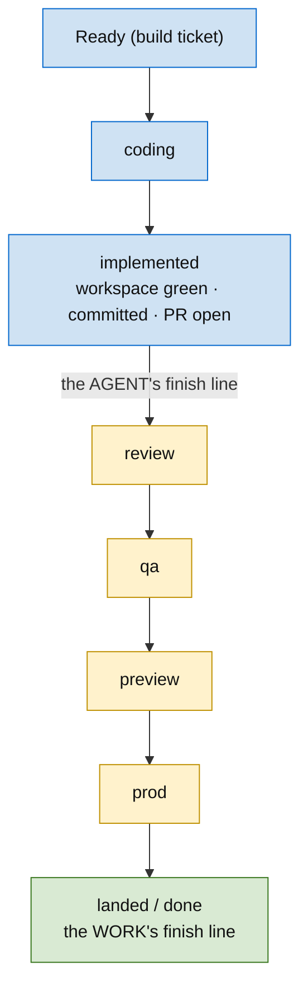
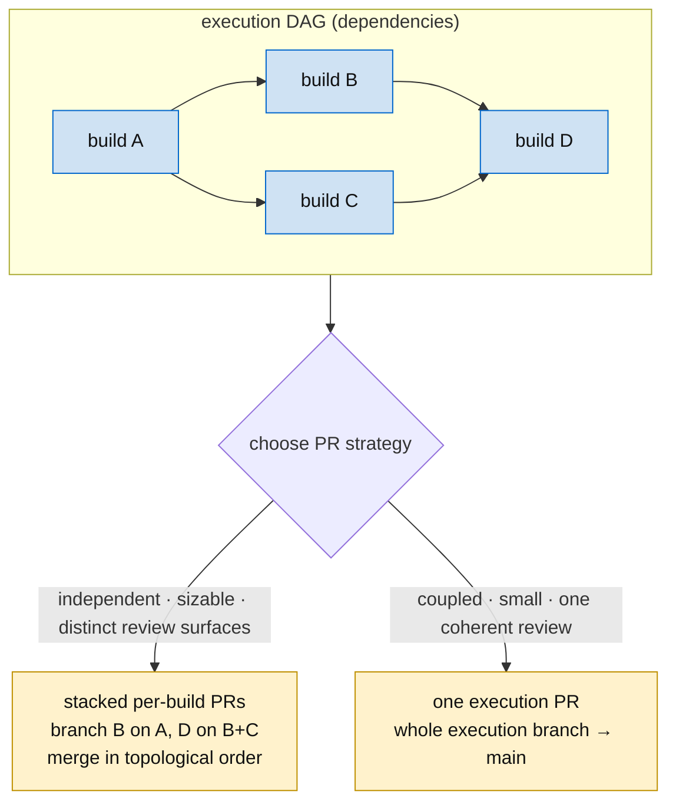
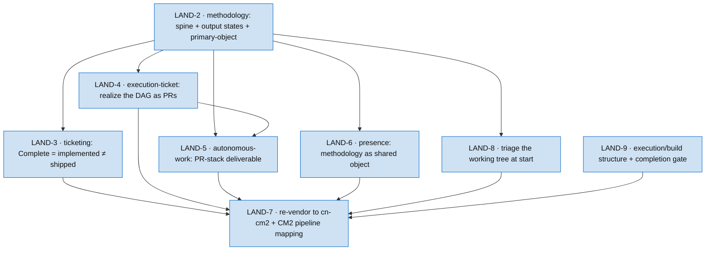

# LAND-1: The execution-and-landing half of the methodology

The methodology spine stops at "build is written." This epic adds the half that autonomous work actually lives in: **how built work lands**, given that in a real pipeline environment code-complete is not done.

## Problem

The methodology today is all **authoring** — goal → milestone → scope → execution DAG → spikes → builds. It says how to *plan and write* a build, and nothing about what happens after. But the moment you put a document into action by writing code, two facts intrude that the methodology is silent on:

1. **"Is the build closed?" has no clean yes.** The ticketing skill's `Complete` means "workspace green + committed." In a review/QA pipeline (CM2: coding → review → qa → preview → prod → done), that is *not* shipped. The author's finish line and the work's finish line are different lines, and the methodology conflates them.
2. **Long sessions complete deeply-nested work that isn't PR'd.** An autonomous block can finish a whole execution DAG locally. That leaves a pile of overlapping changes with no discipline for *tracking* them or *landing* them in dependency order.

## The insight

**The execution DAG is not only a planning artifact — it is the merge plan.** The git topology mirrors the DAG, and landing is a topological walk of it through the review/QA pipeline.

## The shape

### A build has two completion boundaries

`Complete` is redefined as **implemented + handed to the pipeline (PR open)** — the most an agent can reach, because review and QA are not its to do. The build is not *closed*; it is *handed off*. Closure belongs to the pipeline.

### The DAG becomes the branch topology and the PR plan

- **Dependency edges become branch-base edges:** build B (depends on A) is branched off A's branch, not main. "Modifications of dependencies follow the execution DAG" is literal.
- **Two PR strategies, chosen by reviewer load + coupling** (recorded on the execution ticket):
  - **Stacked per-build PRs** — each build its own PR; merged in topo order. Each PR links the PR(s) it sits on and the next to merge, and carries the **execution-DAG diagram with the merge frontier marked** (merged green · this PR current · blocked-behind gray).
  - **One execution PR** — the whole execution branch lands as a single PR; link the execution ticket only and show its DAG.

## Decisions encoded (the contract this epic delivers)

| Decision | Statement | Ticket |
|---|---|---|
| Completion boundary | `Complete` = implemented + PR open ≠ shipped; the pipeline closes it | LAND-3 |
| Output states | the lifecycle a build moves through (Ready → coding → implemented → review → qa → … → landed), agent-boundary vs pipeline-boundary named | LAND-2 |
| Git topology | branch tree mirrors the execution DAG; dependency edge = branch-base edge | LAND-4 |
| PR strategy | stacked-per-build vs one-execution-PR, chosen by reviewer-load + coupling | LAND-4 |
| Frontier convention | each PR links next-to-merge + embeds the DAG diagram with the frontier marked | LAND-4 |
| Methodology is the primary object | both planning and autonomous execution follow the methodology skill; autonomous work's terminal deliverable is the PR topology, not a commit pile | LAND-2, LAND-5 |
| Working-tree triage (start-of-work) | a dirty/unknown change is categorized and routed — moved to its own body of work, or ticketed at the top of this DAG; never silently built on | LAND-8 |
| Execution/build structure | execution-with-children holds no work; build is a leaf; walk up to the next unstarted build; mark in-progress on start; branch-on-build; execution ticket ends in a completion-gate task | LAND-9 |

## Execution DAG (this epic)

LAND-2 pins the vocabulary (the boundary + the states) that 3/4/5/6 condition on, so it lands first. 3, 4, 6 are independent of each other (distinct files); 5 needs 4's PR convention; 7 re-vendors the lot into cn-cm2.

## Interface contract (what this epic provides downstream)

A methodology that, end-to-end, tells an agent how to take a goal to a *reviewable, dependency-ordered set of PRs* — and tells a reviewer where any PR sits in the merge frontier. Consumed by every future autonomous session and every execution-ticket author.

## Dogfood note

This epic is itself an execution DAG. When implemented it should be landed using the very pattern it defines — most likely **one execution PR** (the six doc-changes are tightly coupled and read best as one review), linking LAND-1 and showing this diagram.

## Builds

- **LAND-2** — `methodology/SKILL.md`: extend the spine past builds; name the output states; make methodology the primary object.
- **LAND-3** — `ticketing/SKILL.md`: redefine `Complete` (implemented/PR-open ≠ shipped); fix the integration-gate + status sections.
- **LAND-4** — `ticketing/execution-ticket.md`: "Realizing the DAG as PRs" — topology, two strategies + criterion, frontier-diagram convention.
- **LAND-5** — `autonomous-work/SKILL.md`: recenter on methodology + output states; terminal deliverable = DAG-ordered PR stack (or one execution PR) + frontier diagrams + SESSION_LOG.
- **LAND-6** — `presence/SKILL.md`: methodology as the shared primary object when reasoning with the user.
- **LAND-7** — re-vendor LAND-2…6 (+8) into `cn-cm2-skills` and map the abstract pipeline to CM2's Linear states.
- **LAND-8** — `methodology` + `autonomous-work`: triage the working tree at the start of work — categorize a dirty/unknown change and route it (move to its own body of work, or ticket it at the top of this DAG). The start-of-work mirror of the landing discipline.
- **LAND-9** — `ticketing/execution-ticket.md`: pin the execution/build structure — container-vs-leaf, up-the-tree traversal to the next unstarted build, in-progress marking for concurrency, branch-on-build, and a mandatory completion-gate task.
