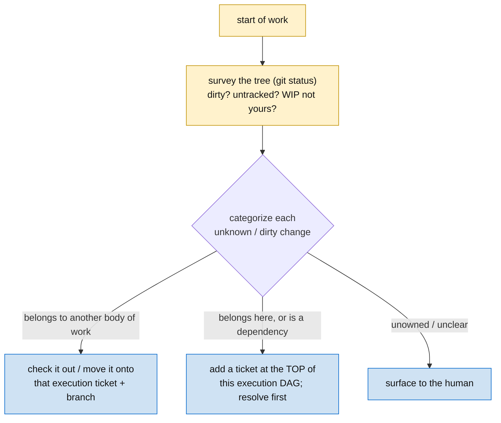

# LAND-8: triage the working tree before starting

## Problem

Starting new work has no stated discipline for a **dirty tree or an unknown file** — uncommitted changes, untracked files, WIP that isn't yours. The agent either builds on top of unknown state (entangling someone else's work into its commit) or stalls. There's no rule for *categorizing* the surprise and *routing* it.

## Evidence

Hit live in this epic: implementing LAND required editing `methodology` and `execution-ticket`, which turned out to be **uncommitted WIP that wasn't the agent's** — alongside other untracked skills and large uncommitted additions. The correct move was to stop, categorize, and get a human decision (bundle vs separate) before committing. That move should be *methodology*, not improvised each time. It's the start-of-work mirror of LAND's end-of-work landing discipline: both are about not conflating distinct bodies of work in git.

## Provides (output contract)

| Output | Shape | Consumed by |
|---|---|---|
| Working-tree triage discipline | survey at start → categorize each dirty/unknown change → route it | methodology start-of-loop; autonomous-work Bootstrap; cn-cm2 vendoring (LAND-7) |

## Required behavior

Add the discipline in two places:

- **`methodology/SKILL.md`** — a start-of-work step: before building, survey the tree (`git status`); for each dirty/unknown change, **categorize and route**:

  - **Belongs to another body of work** → check it out / move it onto that work's execution ticket + branch; don't drag it into this commit.
  - **Belongs here, or is a dependency of this work** → add a ticket at the **top of this execution DAG** and resolve it first (it gates the work that conditions on it).
  - **Unowned / unclear** → surface to the human; don't guess.
  - Never silently build on, or commit, a change you can't categorize.

- **`autonomous-work/SKILL.md`** — Bootstrap gains a survey step: the block opens with a tree survey, and any pre-existing dirty/unknown change is triaged by the same rule before the first real commit (you commit only what this session owns).

## Acceptance

1. `methodology/SKILL.md` has the start-of-work triage step with the categorize→route diagram.
2. `autonomous-work/SKILL.md` Bootstrap surveys the tree and routes pre-existing changes before the first commit.
3. Both name the "ticket at the top of the DAG vs move to its own body of work" fork; no external refs.
