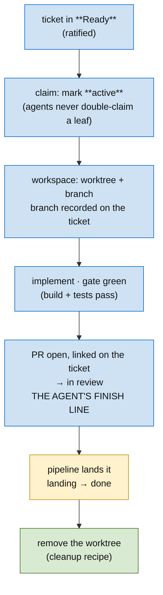

# Skill: Building

**In one line:** take a ratified ticket from **Ready** to a landed PR without entangling bodies of work — one worktree per body of work, every worktree tracked, the branch tree mirroring the DAG.

[Planning](../planning/SKILL.md) ends when the human ratifies tickets; building is everything after — the phase where workspaces exist. Its central discipline: **a workspace is an artifact of the work, with the same lifecycle as the ticket it serves.** Created when the build starts, attributable while it lives, removed when the work lands. An unattributable worktree is the same failure as an unstated DAG edge — state the system carries that the plan doesn't know about.

## The per-ticket build loop

## Workspaces — one worktree per body of work

A *body of work* is an execution branch or a build branch — never "whatever I'm doing today." Rules:

1. **One worktree ↔ one ticket + branch, by naming convention.** The branch is named for its ticket (carrying the ticket id — `…/cmd-1858-…`); the worktree dir is named after the work (`<repo>-<ticket-or-dotted-build>`, e.g. `app-cm-cmd-1858`, `app-cm-m2a-b5`). The convention is what makes attribution *mechanical*: worktree → branch → ticket id falls out of the names alone.
2. **Worktrees are tracked state — one command checks them.** [`bin/worktree-census`](../../bin/worktree-census) (run from any worktree) maps every entry → branch → ticket id and flags `COLLECT?`/`ARCHIVE?`/`RESCUE?` candidates; the `?` is the part git can't answer — the ticket's state — resolved by querying the tracker. Run it at orientation and at landing. Every entry must be attributable to: *my current work* · *another live ticket* · *a running agent* (`.claude/worktrees/agent-*`) · **unknown → triage it now**.
3. **Agent worktrees count.** Subagent worktrees auto-clean only when unchanged; a crashed or interrupted agent leaves one behind. Sweep them with the same attribution test — a locked one may belong to a *running* agent; verify before touching.
4. **Created at **active**, removed after **done** (or **archived**).** Removal follows the [cleanup recipe](../../docs/recipes/_common/clean-up-worktrees.md): dirty-check, unpushed-check, archive-before-delete for unmerged value — never `--force` past the dirty guard.

## Triage the tree before you build

Survey the workspace before writing (`git status`, `git worktree list`). A dirty tree or a file you don't recognize is a load-bearing fact about *some* body of work — categorize it before you commit anything, or two bodies of work entangle in one diff:

- **Belongs to another body of work** → move it onto that work's ticket + branch (its own worktree).
- **Belongs here, or is a dependency** → a ticket at the **top of this execution DAG**; resolve it first.
- **Unowned / unclear** → surface to the human; never silently build on it.

## Landing — the branch tree mirrors the DAG

A build's dependency edge is a branch-base edge: build B (depends on A) branches off A's branch, not `main`. Landing is a topological walk — stacked per-build PRs or one execution PR, chosen by reviewer load + coupling ([execution-ticket](../ticketing/execution-ticket.md) → "Realizing the DAG as PRs"). Two finish lines, never conflated: **PR-open (**in review**) is the agent's; **done** is the work's** — the pipeline owns the gap ([methodology](../methodology/SKILL.md) → state machine). While a stack is open, its branches' worktrees stay attributable; when the stack lands, they all come due for cleanup in the same pass.

## Rules

1. **No work outside a worktree's ticket.** If it isn't this worktree's body of work, it doesn't go in this worktree's commits.
2. **Every worktree attributable, always.** Unknown worktree = stop and triage, same as a dirty tree.
3. **The gate before the PR.** Build + tests green in *this* workspace before **in review** — the integration gate ([ticketing](../ticketing/SKILL.md)).
4. **Clean up in the same pass as landing/archiving.** A landed build's worktree is not "for later" — later is how this repo accumulated a dozen stale ones. Archiving includes the workspace (the superseded-build pointer comment names the branch/tag; the worktree goes).
5. **Filesystem tools respect worktree boundaries.** Grep refs (`git grep <ref> --`), not the directory tree — sibling worktrees pollute filesystem-wide searches (`per recipe _common/orient-on-a-pr-stack`).

## Pointers

- Cleanup procedure (earned): [`docs/recipes/_common/clean-up-worktrees.md`](../../docs/recipes/_common/clean-up-worktrees.md)
- The state machine + finish lines: [methodology](../methodology/SKILL.md)
- PR stacking, merge frontier: [execution-ticket](../ticketing/execution-ticket.md)
- The integration gate, archive-before-delete: [ticketing](../ticketing/SKILL.md)
- Session pickup over an unknown tree: [orient](../orient/SKILL.md)
