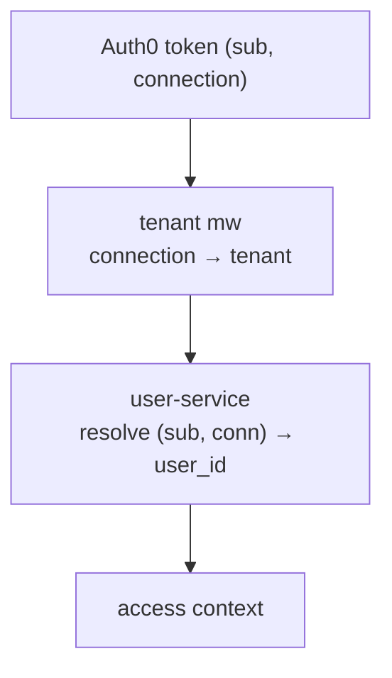
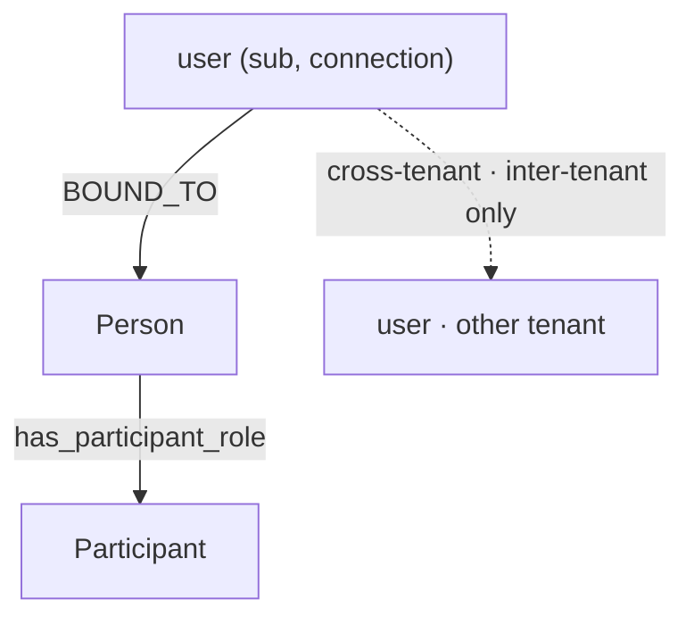
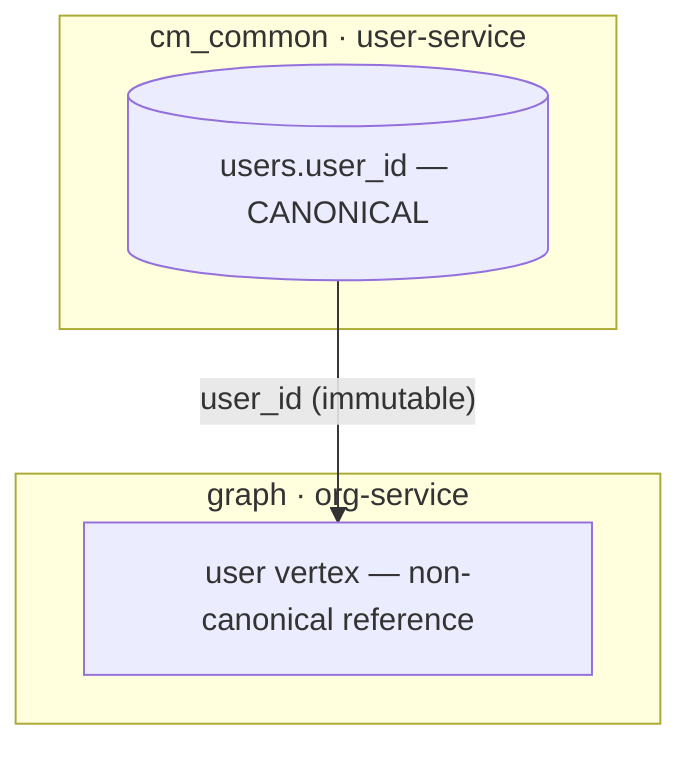
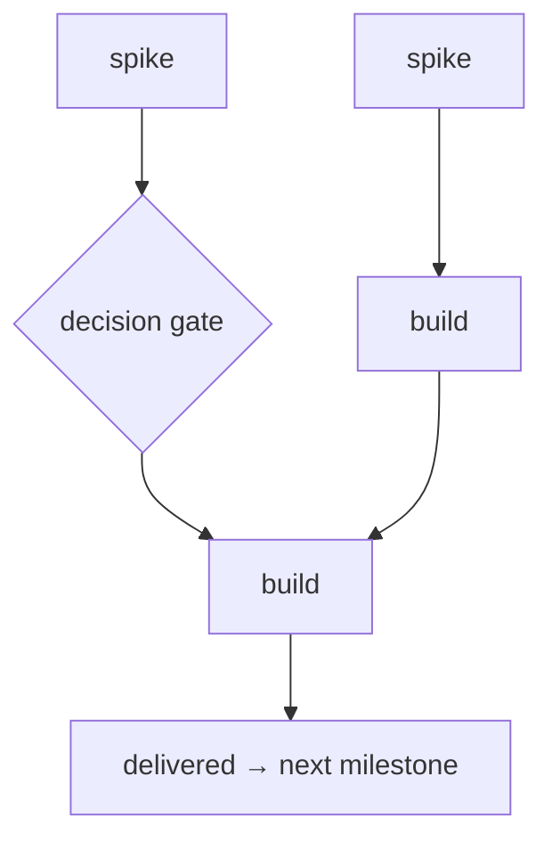
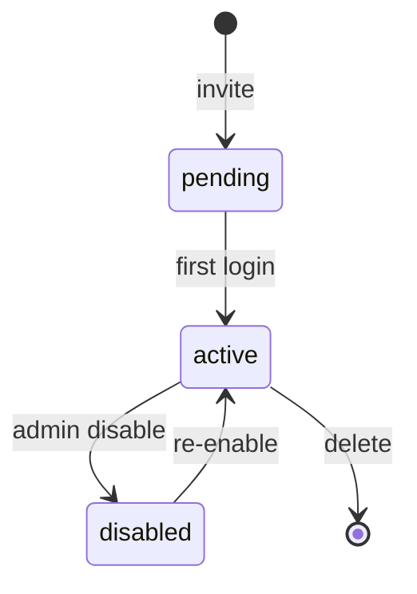
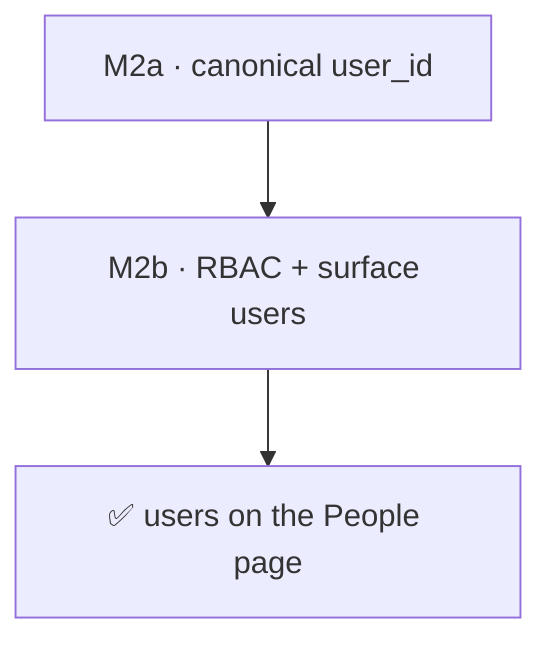
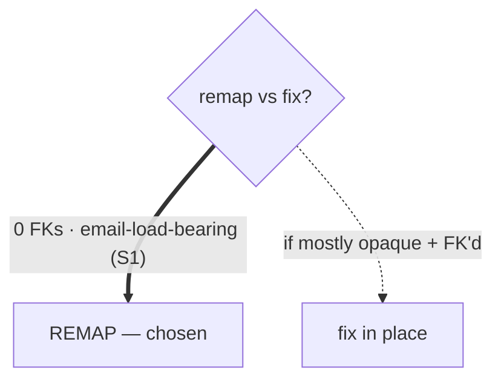
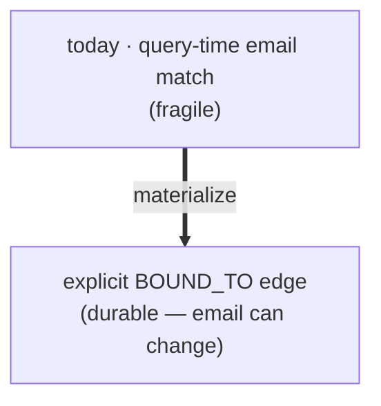
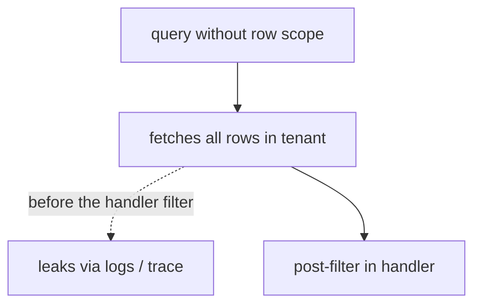

# Diagramming · the lens set

A system is understood through *many* diagrams, each a different lens; no single one captures it. Reach for the lenses the work has — most non-trivial work wants several. Each below is *what it answers* + a small drawn starting shape (all vertical). Best practices + gotchas live in [SKILL.md](SKILL.md).

## Provenance / resolution flow
*Where does a value come from, through what hops?*

## Graph abstraction
*What are the entities and how are they linked?*

## Ownership / boundary partition
*Where does the source of truth live, and what crosses a boundary?*

## DAG — work / dependencies
*What's the work and in what order?*

## State / lifecycle
*What states exist and what moves between them?* (A state machine, not a flow.)

## Payoff / contribution chain
*Why does this matter and where does it land?*

## Decision gate
*What choice is open, on what evidence?*

## Before → after
*What exactly changes?*

## Failure mode
*What goes wrong without this work — the path a value escapes on?*

The set is open — add a lens when the work has one these don't capture.
