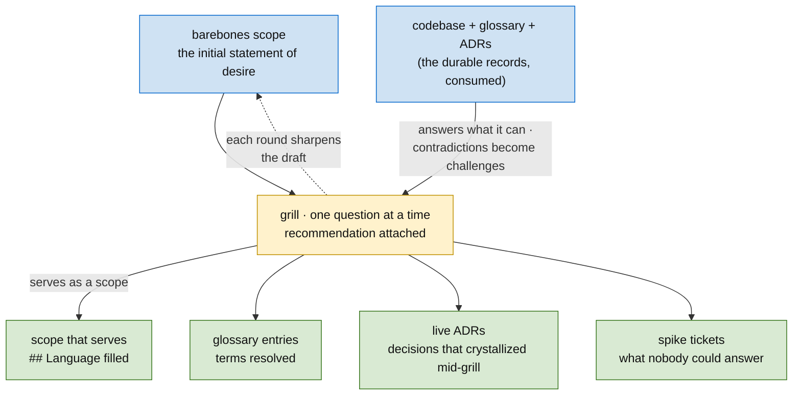

# Skill: Grill (iterate the scope until it serves)

**In one line:** take the barebones scope — the initial statement of desire — and interrogate it with the human, one recommended-answer question at a time, until it serves as a scope: language resolved, edges drawn, every open decision closed, spiked, or recorded.

Grilling is **scoping's iteration engine**. A scope isn't written in one sitting — it starts as a few honest sentences of desire and sharpens round by round. Each round challenges the draft against *the human's intent and the existing domain model* — the glossary, the ADRs, the code. (A spike resolves an unknown against *reality*; grilling resolves it against *intent*. Both close decision gates; grilling runs before the DAG exists, because its answers shape what the DAG even is.)

**Scoping consumes the durable records; it doesn't mint them.** The existing ADRs come in as the rubric — the scope cites "per ADR-NNNN" instead of relitigating. The mining of an execution graph *for* ADRs is the **distill pass**, and it lives execution-side ([execution-ticket](../ticketing/execution-ticket.md) → "Distill nodes"), not here. What grilling does mint: glossary entries for terms it resolves, and the occasional **live ADR** when a decision crystallizes mid-grill and passes the earn-it test.



## When to use

- **Iterating every scope** — from the barebones statement of desire until it passes the [serves-as-a-scope test](../ticketing/scope-ticket.md); the opening moves of [planning](../planning/SKILL.md).
- Before growing a large execution DAG, when the design still has open branches.
- When key terms wobble — the human uses one word for two concepts, or two words for one.
- When a plan was drafted cold (by an agent, from a pitch) and hasn't survived contact with its owner yet.

**Don't use for:** a one-diff build (just build it); purely mechanical work; questions the codebase can answer (go read it — that's a rule, below).

## Inputs

| Input | Description | Example |
|-------|-------------|---------|
| The barebones scope | The initial statement of desire being iterated | a scope ticket draft, a milestone pitch |
| The durable records | Glossary + ADRs + the code itself — consumed as the rubric | `CONTEXT.md`, `docs/adr/`, the repo |
| The human | The owner whose intent is the ground truth being interrogated | — |

## Output

- A **scope that serves** — passing the [serves-as-a-scope test](../ticketing/scope-ticket.md): `## Language` filled, decisions moved into *Decided shape*, residual opens listed honestly as questions or spikes.
- **Glossary entries** for every term resolved or invented (`CONTEXT.md`).
- **Live ADRs** for decisions that crystallize mid-grill and pass the earn-it test (`docs/adr/NNNN-slug.md`).
- **Spike tickets** for unknowns neither the human nor the code could answer.

All tracker writes follow the normal **Pending** / human-ratify flow.

## Process

1. **Load the domain first.** Read the repo glossary (`CONTEXT.md`; if a `CONTEXT-MAP.md` exists the repo has multiple contexts — read the map, pick the right one), skim `docs/adr/`, and load the governing methodology skills. You can't challenge language you haven't loaded.
2. **Start from the barebones scope.** The initial statement of desire is the first draft — don't demand more of it than honesty. Each grill round below sharpens it; iterate until the [serves-as-a-scope test](../ticketing/scope-ticket.md) passes.
3. **Walk the design tree one question at a time.** Resolve dependencies between decisions in order — and **every question carries your recommended answer**. Wait for feedback before the next question; never batch.
4. **Codebase before questions.** If the code can answer it, read the code instead of asking. What you bring back is the *contradiction*, not the question: "the code cancels whole Orders, but you just said partial cancellation exists — which is right?"
5. **Challenge against the glossary.** The moment a term conflicts with `CONTEXT.md`, call it out: "the glossary defines *cancellation* as X; you seem to mean Y — which is it?"
6. **Sharpen fuzzy language.** When a word is vague or overloaded, propose the precise canonical term and record the losers under `_Avoid_`. A new term that survives is a new domain concept — flag it as a candidate **newtype** ([strong-typing](../strong-typing/SKILL.md)) on the scope's `## Language`.
7. **Stress with concrete scenarios.** At every concept boundary, invent the edge case that forces precision: "a user bound to two People across tenants — what does the resolution return?"
8. **Write the records inline, lazily.** A term resolved → glossary entry *now*, not batched. A decision that's hard-to-reverse ∧ surprising ∧ a real trade-off → offer an ADR (all three or skip). Create `CONTEXT.md` / `docs/adr/` only when the first entry exists.
9. **Land it in the scope ticket — and check the exit test.** Terms touched/invented → `## Language`; closed decisions → *Decided shape* with their why; what nobody could answer → a spike ticket, not an assumption. Then run the serves-as-a-scope test: fail any leg → another round; pass all four → **stop** — more scope detail past this point is execution work leaking upward.

## Rules

- **One question at a time, recommendation attached.** A question without a recommended answer outsources the thinking; a batch of questions gets shallow answers to all of them.
- **Codebase before questions.** Asking the human what the code already says wastes the scarce resource (their attention) and trains them to skim your questions.
- **The glossary is language only.** No implementation detail, ever — it's a glossary, not a spec, scratch pad, or design doc. Project-specific concepts only (no general programming terms). Be opinionated: one canonical word per concept, rivals under `_Avoid_`.
- **ADRs sparingly — the earn-it test, all three.** Hard to reverse ∧ surprising without context ∧ a real trade-off. Easy to reverse → you'll just reverse it; not surprising → nobody will wonder; no alternative → nothing to record.
- **Unknowns that survive grilling are spikes, not assumptions.** If neither the human nor the code can answer, the question becomes a spike ticket — never a silent guess baked into the contract.
- **Lazy files.** Create the glossary/ADR files when there's something to write, not as ceremony.
- **The human ratifies.** Grilling sharpens; it doesn't decide. Substantive writes are proposed, per the house flow.

## Formats

### Glossary — `CONTEXT.md` at the worked-on repo's root

```markdown
# {Context name}

{One or two sentences: what this context is and why it exists.}

## Language

**User**:
The authenticated identity — an Auth0 (sub, connection) pair resolved
to a canonical `user_uuid`. Not a Person.
_Avoid_: account, login

**Person**:
A human in the org graph; a User is BOUND_TO at most one Person per tenant.
_Avoid_: profile, member
```

Tight definitions (one–two sentences, what it *is*); group under subheadings only when natural clusters emerge. Multi-context repos add a root `CONTEXT-MAP.md` listing each context's `CONTEXT.md` and the relationships between them.

### ADR — `docs/adr/NNNN-slug.md`, sequential

```markdown
# Identity resolves at the user-service boundary

Org-service was resolving Auth0 connection → tenant itself, re-crossing
the boundary M2a exists to fix. Decided: the graph user node carries
`user_uuid` only; (sub, connection) → (user_uuid, tenant) resolution
lives in user-service; org never resolves identity.
```

1–3 sentences: context, decision, why. Optional `Status` / `Considered options` / `Consequences` only when they earn their lines. Numbering: scan `docs/adr/` for the highest, increment.

## Examples

**Good grill question** (one question, code consulted, recommendation attached):

> You've used "user" for three different things in this pitch. The graph already distinguishes **user** (the authenticated identity, `user_uuid`), **Person** (a human in the org graph), and **Participant** (a Person's role in a survey). When you say "users on the People page," I believe you mean *Persons with a bound User* — my recommendation, since the page is org-scoped and unbound Persons should still render. Confirm?

**Bad grill question** (batched, no recommendations, half answerable from code):

> What about auth? Also, which database does this use? And how should errors work? And do we support multi-tenant?

**Good glossary entry:**

> **Participant**: a Person's role within a specific survey engagement. _Avoid_: respondent, user

**Bad glossary entry:**

> **Participant**: stored in the participants table with a v7 uuid, joined to surveys via participant_survey, soft-deleted via deleted_at.

(Implementation, not language — that's a schema description living in the wrong house.)

**Good ADR offer:** the user-service boundary decision above — reversing it means re-plumbing resolution across services (hard to reverse), a reader would assume org can resolve its own tenants (surprising), and resolve-in-org was a real alternative (trade-off). All three → offer it.

**Bad ADR offer:** "we use gofmt." Reversible in a minute, surprising to no one, no real alternative — fails all three; skip.

## Pointers

- Where grilling sits in the opening moves: `../planning/SKILL.md` → "Start here — the first moves"
- The scope ticket it lands in (`## Language`): `../ticketing/scope-ticket.md`
- Glossary term → newtype pipeline: `../strong-typing/SKILL.md`
- ADR convention + earn-it test: `../planning/SKILL.md` → "Decision records (ADRs)"
- The durable-records family this feeds: `../methodology/SKILL.md` → "Durable records"
- The close-time sibling (procedures, not point decisions): `../recipe/SKILL.md`
