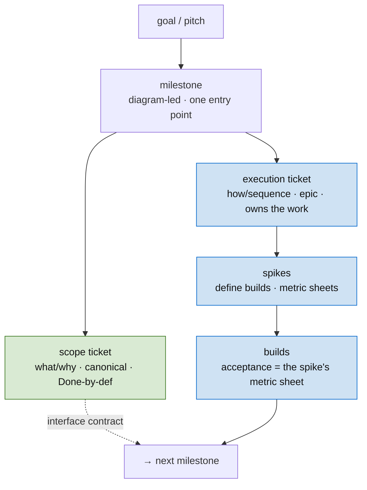
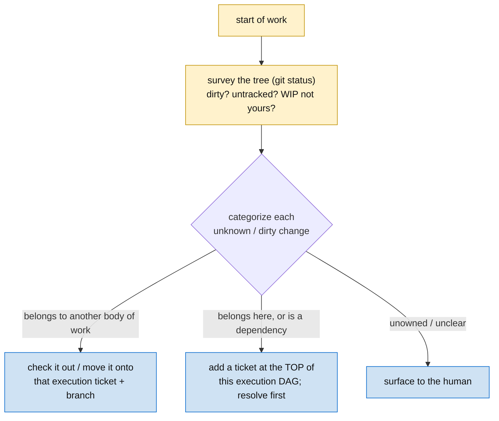
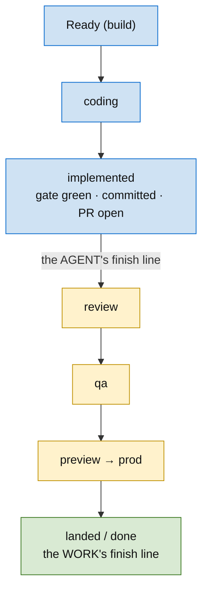

# Skill: The Methodology

The operating system for multi-agent, multi-session software work. This is the **high-level map** — each step routes to the skill that governs it in detail, and each concrete ticket *instantiates* a step (and links back to it). Read this to know *which discipline applies where*; read the linked skill to *do* the step. This methodology is the **primary object** an agent follows: planning *authors* its artifacts, autonomous execution *walks* them, a presence session reasons *over* them — and the work runs from a goal all the way to **landed**, not merely written.

## The spine

**The human decides; the agent executes; the ticket is the interface.**

Two invariants every artifact obeys:

- **Linguistic belief state.** Every artifact carries forward both its *value* (the contract, the type, the finding, the metric) AND the *evidence* that justifies it. Downstream agents condition on the evidence — so a contract questioned three steps later starts from recorded reasoning, not cold.
- **The doc is the source of truth; the tracker is a projection.** Decide and argue the plan in the document; project it into tickets. Never let the tracker become where the plan is decided.

## The artifact ladder

A goal resolves into a fixed hierarchy. Each rung is a different *kind* of thing, governed by a different skill:

| Rung | What it is | Governed by |
|---|---|---|
| **Goal / pitch** | the end state, in the human's terms | — (intake) |
| **Milestone** | a vertical slice; diagram-led; one entry point | [planning](../planning/) |
| **Scope ticket** | canonical *what/why*; Done-by-definition once it has issues; never canceled | [planning](../planning/) + [ticketing](../ticketing/) |
| **Execution ticket** | the *how/sequence*; holds the DAG; owns the work as sub-issues | [planning](../planning/) |
| **Spike** | bounded discovery; output is evidence — often a pass/fail metric sheet | [planning](../planning/) |
| **Build** | implementation; acceptance = its spike's metric sheet | [ticketing](../ticketing/) + [strong-typing](../strong-typing/) |

The concept layer the tickets project *from* — the canonical, diagram-dense docs — is governed by **concept-mapping** (`~/dev/cn/cn-cm2-skills/skills/concept-mapping/SKILL.md`).

**The ladder recurses — and the build/execution boundary is a test, not a fixed label.** An execution ticket decomposes into *sub-execution tickets*, bottoming out at **build tickets** small and self-contained enough for a subagent to execute from the ticket alone. That smallness *is* the test: a build that turns out too complex to do directly was mis-classified — **promote it to its own execution ticket** and let its sub-tickets take over. Reclassifying up is normal — the same move as "an unpinned fact is a spike," applied to size. Execution tickets are written *for subagent execution*.

## Before you start: triage the tree

Before building, survey the working tree (`git status`). A **dirty tree or a file you don't recognize** is a load-bearing fact about some *other* body of work — categorize it before you write, or you'll entangle two bodies of work in one commit.

- **Belongs to another body of work** → check it out / move it onto that work's execution ticket + branch; don't drag it into this commit.
- **Belongs here, or is a dependency of this work** → add a ticket at the **top of this execution DAG** and resolve it first; the work that conditions on it waits.
- **Unowned / unclear** → surface to the human; don't guess.

Never silently build on, or commit, a change you can't categorize.

## The loop

1. **Goal in** → shape it in the doc; diagram it from several lenses (concept-mapping).
2. **Decompose** into a milestone DAG (planning): roots, leaves, parallel branches.
3. **Split each milestone** into a scope ticket (canonical view) and an execution ticket (the DAG).
4. **Unknowns become spikes, not premature builds.** A `low`-confidence build must have a spike in its `blocked_by`.
5. **Run spikes** count-first under a token ceiling. Their evidence is a metric sheet whose command becomes the build's acceptance gate; decision gates in the DAG are closed by spike evidence, not pre-decided.
6. **Spikes define builds 1:1.** Promote builds; the human flips `Pending → Ready`.
7. **Implement in parallel** where the DAG allows. A build is **implemented** when its gate is green (the metric command re-runs clean / the integration build + tests pass) *and* it is PR-open — the agent's finish line. It is **landed** only once that PR clears the review/QA pipeline (see *From build to landed* below).
8. **Calibrate** at close; **restructure cleanly** whenever the model shifts (extract a milestone, sweep docs + tickets, supersede with pointers).

(The README's "How a planned epic flows" is this same loop at ticket granularity.)

## From build to landed — the execution-and-landing half

The loop *authors* the work. Putting the documents into action — writing the code that closes a build ticket — runs into a fact the loop is silent on: **in a review/QA environment, code-complete is not done.** A build has two completion boundaries:

**Output states.** A build moves `Ready → coding → implemented → review → qa → … → landed`. The agent drives it to **implemented** (PR open, handed off); the pipeline drives it to **landed**. "Is the build closed?" → no: it is *handed off*, and closure belongs to the pipeline. `Complete` (ticketing) means implemented + PR-open, not shipped.

**The execution DAG is the merge plan.** When a long session finishes deeply-nested work, it lands as a topological walk of the DAG: the git branch tree mirrors the dependency edges, and the work becomes either a stack of per-build PRs or one execution PR — linked in merge order, each carrying the DAG diagram with the merge frontier marked.

- a build's `Complete` → [ticketing](../ticketing/)
- the DAG → branches + PRs (the two strategies, the frontier diagram) → [ticketing/execution-ticket](../ticketing/execution-ticket.md)
- the terminal deliverable of an autonomous session (the PR topology, not a commit pile) → [autonomous-work](../autonomous-work/)

## The skills, by what they govern

**Process — the load-bearing surface:**
- [planning](../planning/) — goal → DAG; the scope/execution split; spikes as evidence; metric-sheet gates; sub-projects; status checks; calibration.
- [diagramming](../diagramming/) — construct information as high-density representations: diagram-over-prose, the lens set. The reader's bandwidth is the bottleneck. Referenced by planning + ticketing.
- [ticketing](../ticketing/) — a single ticket that passes the two-stranger test; the `## Evidence` section downstream tickets condition on.
- [strong-typing](../strong-typing/) — push the evidence into the type system; a newtype is a compiler-enforced contract.
- [capability-types](../capability-types/) — types that carry evidence a *check has occurred*; layer them so the wrong path doesn't compile.
- [autonomous-work](../autonomous-work/) — working *for* the user during a granted autonomous block.

**Posture:**
- [presence](../presence/) — bilateral collaboration for design and judgment calls.

**Domain:**
- [security-review](../security-review/) — SOC2-grouped review; multi-trial aggregation; severity + direction-of-impact calibration.
- [forecast](../forecast/) — a calibrated probability with a structured belief state.
- concept-mapping (`cn-cm2-skills`) — entity-focused canonical docs, cross-linked and diagram-dense.

## Cross-cutting disciplines

- **Diagrams from many lenses, load-bearing.** Any information built for a human gets the highest-density faithful representation; a system is drawn from several lenses, never one diagram. (See the [diagramming](../diagramming/) skill.)
- **Pass/fail metrics are the unit of done.** A finding that can't be written as `metric → current → target → command` isn't finished; the command is the regression gate.
- **Bounded discovery.** Spikes run count-first under an explicit token/effort ceiling; sub-investigations return conclusions, not file dumps.
- **Assume stale; verify live.** Re-derive from the live tracker + code, not forwarded prose; mark inferences `[confirm]` rather than baking guesses into the source of truth.
- **Human ratifies at the forks; the agent sweeps the mechanics.** Substantive writes get proposed for approval; mechanical sweeps (renames, re-files, bulk creation) fan out to subagents to keep the lead context lean.
- **State conventions carry meaning.** Scope `Done` on first child issue / never `Canceled`; execution in-progress until the flow is defined; spike `Done` on result (even "decision needed"); superseded work `Canceled` *with a pointer*.
- **Pin every load-bearing fact, or it's a spike.** A fact is pinned by reality — a GitHub permalink, a prior ticket's output, or a recorded "we looked and found." An unpinned load-bearing fact is a latent spike; the plan isn't done until it's pinned.
- **Pin before you parallelize.** Parallel-by-default holds only across *pinned* edges. Start dependents across an unconfirmed fact and one wrong fact cascades into every ticket that conditioned on it — so a build whose failure would cascade was a dependency that should have been confirmed first.
- **Type-first, fan-out.** Model the DAG over *software structures* (types, interfaces, methods) — not files. Each build *creates* some structures and *consumes* others; every consumed structure must be produced by an upstream node. Construct shared structures **first**, at the roots, before the functionality that uses them — then fan the functional builds out from those roots. Built once, dependents safely parallel; a structure that is a root can't be re-minted by two siblings, so the duplicate-definition / integration-collision class disappears. The structural ally of [strong-typing](../strong-typing/): the type is the contract — build it before the behavior.

## Tickets link back to the method

Each ticket *instantiates* a step of this methodology: a spike ticket is an instance of planning's spike discipline; a build ticket is an instance of ticketing. **Link the ticket to the method step it instantiates** (and to the canonical concept doc it projects from), so the high-level map and the in-context how-to stay connected both ways — the skill says *how the step is done in general*, the ticket says *how it's done here*.

## Pointers

- Repo overview + the epic flow at ticket granularity: `../../README.md`
- Methodology section: `~/CLAUDE.md` → "Methodology — Agentic Development"
