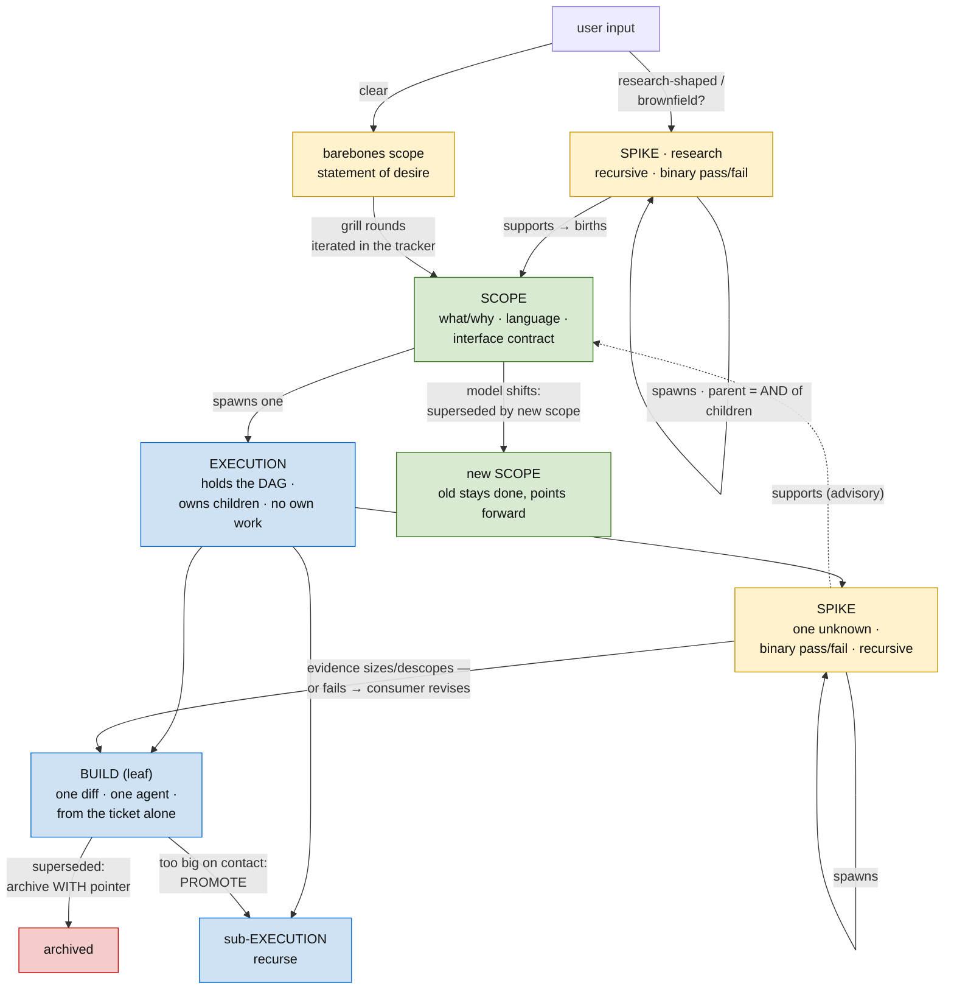
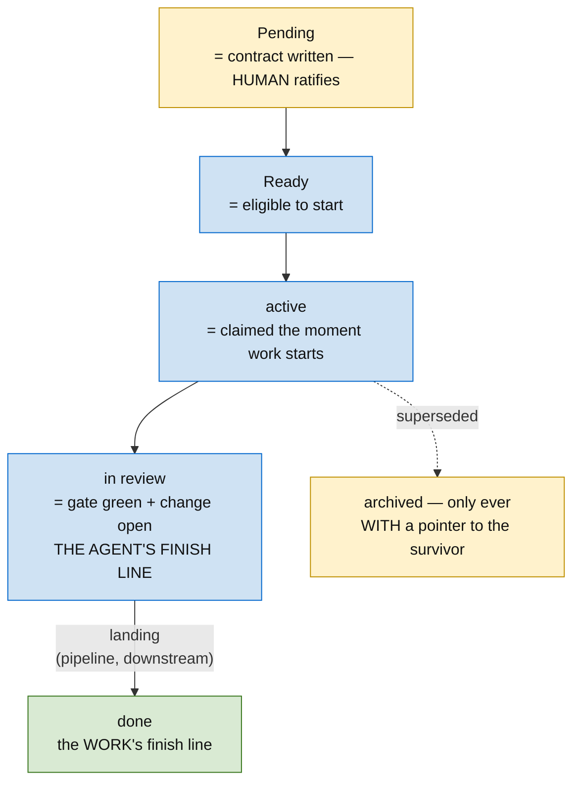

# Skill: The Methodology

**The human decides; the agent executes; the ticket is the interface.** You open by **locating the request in the existing forest** — searching the tracker for related work and placing the request *under* an existing project or as a *sibling* of one, never a reflexive new root (see *Step 0* below). Only then do you write a **barebones scope** in that located position and **grill** it against the durable records (glossary, ADRs) until it serves as a scope — or, when the input is research-shaped or brownfield (a pile of found documents, real uncertainty about *what* the work is), you open one step earlier with a **research spike** that `supports` and gives rise to the scope (`user input → spike? → scope`). Then one fork decides everything after: *is this small enough for one agent to build in one diff?* Yes → it's a **build**; implement it. No → it's a **DAG of smaller executions**, each re-entering the same fork. **Spikes** answer the unknowns that shape the sub-executions. That recursion is the whole method.

Two invariants every artifact obeys:

- **Linguistic belief state.** Every artifact carries its *value* (the contract, the type, the finding) AND the *evidence* that justifies it, so a contract questioned later starts from recorded reasoning, not cold.
- **The tracker is the source of truth.** The scope and execution ticket **bodies are the canonical documents** — long-form prose, evidence, and mermaid live there, and **we iterate there**: grill rounds edit the scope body; DAG changes land on the execution body in the same unit of work as the child tickets. There is no separate plans directory or frontmatter file layer. Evidence pins reality by link — commit-pinned GitHub permalinks, ticket links.

## The node kinds — what each does, what each can become



| Kind | Does for itself | Can become | Skill |
|---|---|---|---|
| **Scope** | canonical *what/why*: language, decided shape, edges, **interface contract** the next milestone conditions on | superseded by a new scope (stays `done`, points forward); **never archived** | [scope-ticket](../ticketing/scope-ticket.md) |
| **Execution** | execution ticket holding the live DAG; owns spikes/builds/sub-executions as children; pure container — work lives only in leaves | collapsed (children absorbed elsewhere, with pointers) | [execution-ticket](../ticketing/execution-ticket.md) |
| **Spike** | the research/evidence primitive at every altitude: resolves one unknown with a **binary pass/fail**; output is evidence that sizes/defines/descopes work — or **births a scope** (`user input → spike → scope`). **Recursive** (spawns sub-spikes; a parent passes iff *every* child passed — any fail ⇒ parent fails, fail-loud). Absorbs brownfield/found material via `supports` edges. | **spawns sub-spikes**; otherwise ends in a result — pass *or* fail (a fail is a confirmed constraint the `supports` consumer salvages from and adapts assumptions to) | [planning](../planning/SKILL.md) |
| **Build** | one diff a subagent implements from the ticket alone; declares `Provides`/`Consumes`; acceptance = its spike's metric sheet or its own criteria | **promoted** to a sub-execution when too big on contact; **archived with a pointer** when superseded | [ticketing](../ticketing/SKILL.md) |
| **Plan node** | mints the next tranche of child tickets once the contract they condition on is ratified — planning in dependency order, shown in the DAG | nothing — it ends in tickets (the DAG's ghost nodes made real) | [execution-ticket](../ticketing/execution-ticket.md) |

Promotion is the size test firing, not a failure: "small enough for one agent from the ticket alone" *is* the build/execution boundary, reassessed on contact. Dotted names track the recursion: `m9.b3.b2` = milestone M9 → build B3 (promoted) → its sub-build B2.

## The state model (lifecycle states, per kind)

Six conceptual states, four overlays. Builds run the full lifecycle; the other kinds use a prefix of it. Only `done` is load-bearing — it is the one state the tracker's readiness logic reasons about.



**Blocked-ness is not a state.** It is *derived* from the dependency edges: a ticket is blocked while any of its dependencies is not `done`. The "what's ready" view is the **readiness query** over those edges — `Ready` ∧ no unresolved dependency. Landing (the steps between `in review` and `done`) is a pipeline concern downstream of the tracker, not a tracker state.

| Kind | Convention |
|---|---|
| **Build** | full lifecycle `Pending → Ready → active → in review → done`. `Pending` = contract written, awaiting human ratification (only the human moves it on). `active` = claimed the moment work starts, so two agents never double-claim a leaf. `in review` = implemented: gate green, change open and linked on the ticket. The pipeline — not the agent — lands it to `done`. |
| **Spike** | `active` → `done` on a *result* — pass **or** fail, both terminal ("a decision is still needed" is a valid result). A parent spike is `done` only when all children are, and **passes iff every child passed** — any child fail ⇒ the parent fails (fail-loud). A failed spike still `done`s with its evidence; the `supports` consumer salvages what holds and revises its assumptions. |
| **Execution** | `active` while any child is unresolved; `done` only when the completion gate passes (after the distill pass). May sit `in review` as a deliberate human-approval gate. `archived` propagates to children. |
| **Scope** | `done` the moment it has ≥1 child ticket — done-by-definition, a living reference, **never archived**. |

## An example tree (fictional milestone)

```
pitch · <pitch>                                    project
└─ M9 · audit log                                  milestone
   ├─ Scope: M9 · audit log                        done · interface contract: AuditEvent, append-only store
   └─ Execution · M9 · audit log                   active · holds the DAG
      ├─ S1 · spike: any writers bypassing the event bus?     done · "no — all 3 go through Publish()"
      ├─ B0 · AuditEvent type root                 done · Provides: AuditEvent, ActorRef
      ├─ B1 · writer adoption (3 sites)            in review · change #412 · Consumes: B0
      ├─ B2 · retention job                        Ready · Consumes: B0
      └─ B3 · query API → PROMOTED                 Execution · M9.B3 · active
         ├─ M9.B3.B1 · cursor pagination           done
         └─ M9.B3.B2 · filter grammar              active
```

The shape to notice: the **shared contract (B0) is the root** every stream consumes — extracted first so no two siblings re-mint it; the spike ran **before** the builds that conditioned on its answer; B3 was a build until contact showed it contained its own DAG, then it was promoted and its children took the dotted names.

## Planning in progress — the same tree, mid-flight

Every event lands as tracker writes **in the same unit of work** — the DAG never lags the work:

| Moment | What happened | Tracker writes, same pass |
|---|---|---|
| Spike lands | S1 finds no bypass writers — planned build B4 ("bypass shim") is unnecessary | S1 → `done` with the evidence in its body; B4 → `archived` with a pointer to S1; execution DAG strikes the node; scope's Decided-shape gains the why |
| Review surfaces work | B1's review finds the codec reads untyped props | new build B1.1 created under the execution; parent DAG + work list + decision gate updated; B1.1 cites the review as its sizing evidence |
| Build outgrows | B3's contract needs pagination *and* a grammar — two diffs | B3 promoted to `Execution · M9.B3`; sub-builds created as its children; parent DAG keeps B3 as one node |
| Contract questioned | a consumer asks why `ActorRef` has no email | answered from B0's `## Evidence` — recorded reasoning, no re-derivation |
| Exit | all leaves feed the completion gate | distill pass runs (ADRs/recipes for tracks that earn them); execution → `done`; scope's interface contract is what M10 reads |

The human ratifies at the forks (`Pending` → onward, promotions, archivals, milestone boundaries); the agent sweeps the mechanics and keeps every parent artifact current.

## Step 0 — locate the work before you create it

**A new request is not a new root.** Before any scope is written, the methodology *begins* with discovery: find the work that already relates to the request. The most expensive mistake is minting a fresh disconnected island when a home already exists — every orphan root defeats the invariant that *every node ladders to a goal and there is always one computable next tip*.

So the first move on **every new request** is:

1. **Research existing work.** Search the tracker — by title, body, and tags — for facets touching the same domain, capability, or product as the request, then read the shape of the hits (their subtree, their edges). Assume nothing is new until you have looked. The discovery practice is [orient](../orient/SKILL.md); the concrete tracker queries live in the tracker-interface skill.
2. **Decide placement — under, or sibling.** From what you find, determine where the request lives:
   - **Under an existing project** — it advances a scope/execution that already exists → it becomes a **child** of that node (a build, spike, or sub-execution). *Most requests land here.*
   - **A sibling of an existing project** — it shares a parent goal but is its own milestone → it becomes a **new scope under the same parent** as its closest relative, laddered by `depends_on` where a real ordering exists.
   - **A genuinely new root** — only when nothing existing relates. This is the rare, justified case — **not the default**.
3. **Then, and only then, the rest of the methodology begins** — the barebones scope is written *in its located position*, grilled, and the fork applies. **Placement first; scope second.**

Skipping this and scoping straight into a new root is how the forest fragments into islands no "what's the next tip?" query can answer. (This is the planning-time twin of *Triage the tree before building* below.)

**Brownfield — found material with no relationships.** When the search itself surfaces a heap of orphan documents or plans, don't leave them loose and don't force them into the dependency DAG. Metabolize them with a **research spike**: a spike that cites the found docs as evidence (via `supports`) and `supports` the scope it will give rise to. The spike is how unstructured found material *enters* the methodology — the same `user input → spike → scope` on-ramp, applied to a pile rather than a single request. (Concrete arrangement steps: the tracker-interface skill's "Brownfield" section.)

## The loop

1. **Goal in** → **locate it** (search the tracker; place it *under* an existing project or as a *sibling* — *Step 0* above) → if the input is research-shaped/brownfield, **open with a research spike that `supports`/births the scope** (`user input → spike? → scope`); otherwise barebones scope *in that position* → **grill** ([grill](../grill/SKILL.md)): glossary + ADRs come in as the rubric; new language gets pinned (a new term is a candidate newtype). Iterate the scope body in the tracker until it serves ([scope-ticket](../ticketing/scope-ticket.md) → "When is scoping done").
2. **Spawn the execution ticket**; apply the fork. One diff → a single build. More → grow the DAG: **shared contracts as roots**, spikes for unknowns, builds fanned out wide ([planning](../planning/SKILL.md)).
3. **Unknowns become spikes, not premature builds** — a `low`-confidence build must be blocked by one. Run spikes count-first under a token ceiling; evidence is a metric sheet whose command becomes the build's acceptance gate.
4. **Human ratifies** the builds (`Pending` → `Ready`); agents implement in parallel where the DAG allows — one worktree per body of work, every worktree tracked ([building](../building/SKILL.md)); a build finishes at **change-open** (`in review`), and the pipeline lands it.
5. **Propagate every structural change** (add/remove/promote/re-sequence) onto the execution body in the same pass ([execution-ticket](../ticketing/execution-ticket.md) → "The DAG is live").
6. **Distill before concluding complete**: calibrate confidence priors; run the distill pass over the closed graph — ADRs for decision tracks that pass the earn-it test, recipes for recurring non-obvious paths ([recipe](../recipe/SKILL.md)). The next scope consumes these records instead of re-deriving them — the loop feeds itself.

## Durable records — what survives the loop

Tickets decay with their execution ticket. Three records outlive it, each gated by an earn-it test (the anti-landfill mechanism), all living in the **worked-on repo**:

| Record | Captures | Born at | Earn-it test |
|---|---|---|---|
| **Glossary** (`CONTEXT.md`) | a term — "what do we call this" | scope (grilling) | project-specific concept, not general programming |
| **ADR** (`docs/adr/`) | one decision — "why this way" | execution (distill pass, or live) | hard to reverse ∧ surprising without context ∧ real trade-off |
| **Recipe** | a procedure — "how we do X here" | execution close (distill pass) | recurs ∧ path was non-obvious |

The glossary feeds the type system directly: the canonical term becomes the newtype's name (**grill → glossary → newtype**, [strong-typing](../strong-typing/SKILL.md)).

## The skills, by what they govern

- [planning](../planning/SKILL.md) — goal → DAG; the scope/execution split; spikes as evidence; metric-sheet gates; restructuring; calibration.
- [building](../building/SKILL.md) — ratified ticket → landed PR; one worktree per body of work, every worktree attributable and cleaned up with the landing; branch tree mirrors the DAG.
- [grill](../grill/SKILL.md) — iterate the scope from its barebones statement until it serves; one recommended-answer question at a time.
- [ticketing](../ticketing/SKILL.md) — one ticket passing the two-stranger test; `## Evidence` / `## Provides` / `## Consumes`.
- [diagramming](../diagramming/SKILL.md) — diagram-over-prose; the lens set; the reader's bandwidth is the bottleneck.
- [strong-typing](../strong-typing/SKILL.md) / [capability-types](../capability-types/SKILL.md) — evidence pushed into the type system; the security case where the type proves a check ran.
- [orient](../orient/SKILL.md) — session pickup: load these skills as the rubric, map branch → PR, verify live, report by severity.
- [recipe](../recipe/SKILL.md) — mine a finished execution into a "how we do X here" doc, each rule earned by a real wrong-turn.

## Cross-cutting disciplines

| Discipline | In one line |
|---|---|
| Diagrams from many lenses | Any human-facing artifact gets the densest faithful picture, from several lenses — never one diagram. |
| Pass/fail metrics are the unit of done | If a finding can't be written `metric → current → target → command`, it isn't finished; the command is the regression gate. |
| Bounded discovery | Spikes run count-first under an explicit ceiling; sub-investigations return conclusions, not file dumps. |
| Assume stale; verify live | Re-derive from the tracker + the code, never forwarded prose; mark inferences `[confirm]`. |
| Human ratifies at the forks | Substantive tracker writes are proposed for approval; mechanical sweeps fan out to subagents. |
| Locate before you create | A new request is researched against the tracker *first* and placed under an existing project or as a sibling — never a reflexive new root (*Step 0*). Placement precedes scoping. |
| Research is advisory, never blocking | A spike's `supports` edge — to a scope/execution/build, or to found documents and other DAGs' heads — carries *evidence*, not ordering; it never enters the readiness query. Only `depends_on` blocks. That is what lets a research spike point anywhere and span methodologies without corrupting any DAG. |
| Triage the tree before building | A dirty/unrecognized working tree or worktree belongs to *some* body of work — categorize (move to its ticket+branch / top of this DAG / ask) before you commit anything ([building](../building/SKILL.md)). |
| Pin every load-bearing fact | Pinned = a permalink, a prior ticket's output, a recorded "we looked." An unpinned load-bearing fact is a latent spike. |
| Pin before you parallelize | Parallel-by-default holds only across pinned edges — one wrong unpinned fact cascades into every dependent ticket. |
| Contract-first, fan-out | Model the DAG over shared contracts (capability → API → interface → type, by altitude): produce before consume, extract shared contracts as early roots. A root can't be re-minted by two siblings. |
| Provides/Consumes cross-check | Diff every `Consumes` against every `Provides` — a consume with no producer is a missing root; two producers of one structure is a duplicate owner. Mechanical, required. |
| Types reference their producers | Every consumed type in a contract cites the ticket that produces it — the dependency edge (a directed depends-on edge) is readable from the ticket alone. |

## Pointers

- Repo overview: `../../README.md` · `../../AGENTS.md`
- Ticket body formats: [build](../ticketing/SKILL.md) · [scope](../ticketing/scope-ticket.md) · [execution](../ticketing/execution-ticket.md)
