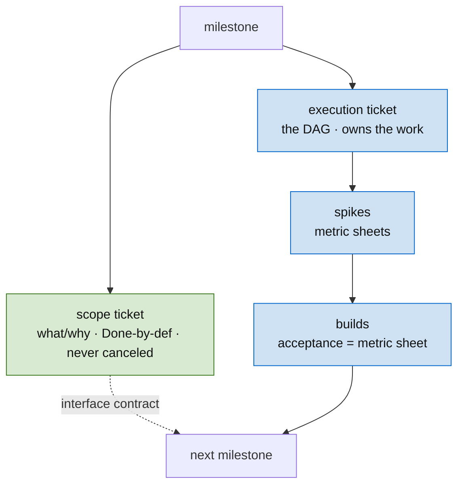

# Skill: Plan an Epic

Break a large goal into a dependency DAG of tickets with explicit inputs, outputs, risks, and parallel execution paths. The plan is a program — tickets are functions, the DAG is the call graph, errors are contract violations between tickets, and **spikes are the evidence-gathering steps that resolve uncertainty before contracts are frozen**.

## When to use

When the user describes a multi-step goal that needs to be broken into implementable units. When a new feature, security hardening pass, or infrastructure change spans multiple files, multiple concerns, or multiple days.

## Inputs

| Input | Description | Example |
|-------|-------------|---------|
| Goal | What the user wants to achieve | "Thread caller identity through Plexus RPC" |
| Constraints | What must not break | "Existing unauthenticated activations must keep working" |
| Domain context | External systems, APIs, regulatory requirements | jsonrpsee 0.26 connection state, cookie validation |
| Existing work | What's already built that this builds on | Plexus dispatch, DynamicHub registration |
| Risk tolerance | How much uncertainty the user accepts before requiring spikes | "Spike anything that depends on jsonrpsee internals" |

## Output

An epic directory under `plans/<EPIC>/` with:
- `<EPIC>-1.md` — epic overview (status: Epic)
- `<EPIC>-N.md` — individual tickets (status: Pending)

## Process

### 1. Identify the end state

What does the system look like when this epic is done? Not the steps to get there — the destination. Write this as the epic's `## Goal`.

### 2. Work backwards from the end state

What's the last thing that needs to happen? That's the leaf ticket. What does it depend on? Those are its `blocked_by` tickets. Keep working backwards until you reach tickets with no dependencies — those are the roots.

### 3. Maximize fan-out

At every node in the DAG, ask: "can any of these blocked tickets run in parallel?" If two tickets touch different files and have no data dependency, they can. The DAG should be wide, not deep. Serial chains are bottlenecks.

### 4. Define inputs and outputs at every edge

If ticket A unlocks ticket B, then A's acceptance criteria must pin exactly what B will read. **A's `## Evidence` section must record *why* the contract has that shape**, so that if A's contract is questioned later, the conversation starts from recorded reasoning rather than restarting cold. Use strong types (domain newtypes, not bare strings) in the contract language.

### 5. Set initial `confidence` per ticket

For each ticket, set the planner's prior on whether the contract survives contact with reality:

- `high` — every dependency is typed and tested; the shape is constrained by upstream contracts.
- `medium` — default; the shape is reasonable but unverified.
- `low` — significant unknowns; spike before promoting to Ready.

A `low`-confidence ticket **must** have a spike in its `blocked_by`. Promoting a `low` ticket to Ready without a spike is a planning error.

### 6. Surface risks → spikes

For every ticket that touches an external system, an unstable API, or an unproven assumption, add a `## Risks` section. Each risk maps to:
- A **spike** — a binary investigation that produces structured evidence (see Spikes section)
- A **fallback** — a degraded-but-acceptable contract revision
- A **replanning trigger** — "if this fails, downstream tickets need rewriting"

### 7. Check for design decisions

If any ticket requires a choice between multiple approaches, it's not ready for implementation. It either needs:
- A spike ticket that resolves the choice (the spike's evidence picks the approach)
- A decision pinned in the ticket text with the rationale recorded in `## Evidence`

### 8. Write tickets in dependency order

Start with the roots (no `blocked_by`), then write each ticket in topological order so you can reference upstream outputs in downstream inputs.

## Epic overview format

```yaml
---
id: EPIC-1
title: "Epic Name — Overview"
status: Epic
type: epic
blocked_by: []
unlocks: []
---
```

Body:

```markdown
## Goal
## Dependency DAG       # ASCII or mermaid
## Phase Breakdown
## Tickets              # table: id, summary, status, confidence
## Risks → Spikes       # which spike addresses which risk
## Out of scope
```

## Principles

- **Parallel by default.** If two tickets CAN run simultaneously, the DAG MUST allow it — but only across *pinned* edges. An unpinned load-bearing fact is a real dependency masquerading as nothing; pin it (a spike) before starting anything that conditions on it. Optimistically starting dependents across an unconfirmed fact is how one wrong fact becomes a cascade of failed tickets.
- **One decision per ticket.** Ambiguity in one ticket cascades to every downstream ticket.
- **Contracts at every edge.** Ticket A's output is ticket B's input. Both must name the same shape.
- **Evidence travels with the contract.** A's `## Evidence` is a sufficient statistic for B; B doesn't need to re-derive A's reasoning.
- **Risks are first-class.** A risk section on a ticket is like error handling in code. Without it, the plan works until it doesn't.
- **Confidence calibrates the plan.** Track which `low`-confidence tickets needed contract revision after their spike, and which didn't. Use that history to set future priors.
- **Pending until approved.** All tickets start at `status: Pending`. Only the user promotes to `Ready`.
- **The doc is the source of truth; the tracker is a projection.** When the plan also lives in a live tracker (Linear, etc.), decide and argue it in the doc and port it out — never let the tracker become where the plan is decided.
- **A spike's evidence can be a re-runnable metric.** When the unknown is quantitative, the spike's deliverable is a metric sheet whose measuring command becomes the unlocked build's acceptance gate — evidence and acceptance criteria collapse into one artifact.
- **Diagrams are load-bearing, and many.** A plan is rendered from several lenses — never a single diagram. If a facet is hard to draw, it isn't understood yet; drawing it *is* the thinking. (See the [diagramming](../diagramming/) skill for the lens set.)

## Projecting the plan into a live tracker

The plan is a set of documents (`plans/<EPIC>/`). When the work is *also* tracked in a live system (Linear, Jira, GitHub Issues), hold one rule: **the plan document is the source of truth; the tracker is a projection.** Decide and argue the plan in the doc, then port it into tickets. If the doc lives somewhere the tracker can't open, port a self-contained summary — not a link.

Project each epic/milestone into two ticket kinds — the *what/why* and the *how*:

- **Scope ticket** — the canonical, always-current view of the system + the plan. The single **entry point** linked from the milestone (lead its description with a diagram). **Done by definition — but only once it has produced ≥1 work issue** (marking it Done while it has no children makes the milestone read complete before the work has started). **Never `Canceled`** — canceled reads as abandoned; this is a living reference.
- **Execution ticket** (an epic) — holds the dependency DAG and **owns the work as sub-issues**. Stays in-progress until the execution *flow is defined* (the spikes have resolved what sizes the builds), then advances as builds land.

Spikes and builds hang off the execution ticket. The scope ticket carries the contract + evidence; the execution ticket carries the sequence.



**State conventions** (the projection of the `plans/` statuses): scope → `Done` on its first child issue, never `Canceled`; execution → in-progress while the flow forms; spike → `Done` once it has a *result* (and "a decision is still needed" is a valid result — the open decision then rides on the build the spike defined, not the spike); build → queued, wired to its dependencies by explicit blocking links (the DAG, made real); superseded work → `Canceled` **with a pointer** to its replacement, never silently dropped.

**Restructure cleanly when the model shifts.** A concept that earns its own milestone, or a decision that re-partitions the work, is the calibration loop firing — expected, not a failure. When it fires: extract the new milestone, sweep *every* affected doc and ticket, re-file work onto the milestone it now belongs to, and cancel duplicates with supersession pointers. The "scope is Done only after it has issues" rule is what stops a freshly-extracted milestone from reading complete with no work in it.

**Human ratifies at the forks; the agent sweeps the mechanics.** Substantive tracker writes — creating tickets in a real project, cancellations, milestone boundaries — get proposed for approval first; the mechanical sweep (renames, re-files, bulk creation) then runs as execution, fanned out to subagents to keep the planning context lean. This is the tracker analog of *Pending until approved*. And **verify against live state**: re-derive the plan's shape from the live tracker + code, not forwarded prose; mark inferences `[confirm]` rather than baking guesses into the source of truth.

## Diagrams — render the plan from many lenses

Scope and execution docs are **diagram-dense by default**. The lens set (provenance, graph, ownership, DAG, lifecycle, payoff, decision, before/after, failure mode), the diagram-over-prose default, and the conventions live in the **[diagramming](../diagramming/)** skill — don't duplicate them here. For a *plan* specifically, the **DAG** and **payoff/contribution** lenses are non-negotiable; reach for the rest as the work calls for them.

## Spikes — evidence-gathering, not binary gates

A spike is a micro-experiment that gathers evidence about an unknown. Its output **updates the confidence prior** on the unlocked ticket; it does not just flip a pass/fail bit.

### A spike is an unpinned load-bearing fact

A load-bearing fact must be **pinned to reality** — a GitHub permalink to the code, a dependency on a prior ticket's output, or a recorded *"we looked and found X."* **An unpinned load-bearing fact is a latent spike.** The execution isn't fully planned until every load-bearing fact is either pinned or has a spike whose job is to pin it. (The metric-sheet spike is this same move — it pins a quantitative fact with a re-runnable command.)

### Spike workflow

1. **Identify the unknowns.** Each unknown becomes a spike (S-01, S-02, ...).
2. **Order spikes by ambition.** S-01 tries the ideal approach. S-02 tries the fallback. S-03 tries a further concession. Run in order; stop at the first one whose evidence is sufficient to lock the contract.
3. **Spikes produce structured evidence.** A spike's deliverable is not "yes" or "no" — it's a paragraph in the unlocked ticket's `## Evidence` section: what was tried, what was observed, what shape the data took, and what that implies for the contract.
4. **Aggregate evidence across multiple spikes when they bear on the same contract.** If S-01 partially succeeds (proves field X is available but field Y is not), S-02 doesn't start from zero — it inherits S-01's evidence and asks the next narrower question. The downstream ticket's `## Evidence` section is the *combined* belief, not the last spike's report.
5. **Update the confidence prior.** A passing spike usually moves the unlocked ticket from `low` → `medium` or `high`. A spike that uncovers a constraint may move it from `medium` → `low` (or trigger replanning).
6. **If all spikes fail:** the risk is a confirmed constraint. Document it in the unlocked ticket's `## Evidence`, and replan downstream tickets. This is normal — the plan discovered a real limitation.
7. **Spike code lives in `<crate>/spike/<epic>/`** as standalone programs.

### Spike ticket format

```yaml
---
id: EPIC-S01
title: "Spike: Does jsonrpsee 0.26 expose cookie headers in on_request?"
status: Pending
type: spike
blocked_by: []
unlocks: [EPIC-N]
confidence: n/a
---
```

```markdown
## Question
Does jsonrpsee 0.26's `on_request` callback receive the WS-upgrade request
with cookie headers intact, or are they consumed before reaching us?

## Setup
Spin up a minimal jsonrpsee server with an `on_request` hook. Send a WS
upgrade with `Cookie: session=abc`. Log what the hook receives.

## Pass condition
The hook observes `Cookie: session=abc` in the request headers.

## Evidence to record (regardless of pass/fail)
- What the request struct exposes (full headers? trimmed? mutated?)
- Whether `extensions()` is writable from the hook (needed for AUTH-7's design)
- Any version-specific behavior worth pinning in Cargo.toml

## Fail → next
S-02: Use a tower middleware layer above jsonrpsee to capture cookies before
the upgrade, then thread via Extensions.

## Fail → fallback
If neither spike works: route auth through a separate HTTP endpoint that
issues a one-time WS connect token. Document as a known limitation;
contract for AUTH-2 changes from "cookie at upgrade" to "token at upgrade".
```

**Key rule:** A spike that requires a judgment call to decide pass/fail is not a spike. The pass condition must be binary. But the *evidence* the spike records is structured prose, not a bit — that evidence is what downstream tickets condition on.

### Spike evidence as a pass/fail metric sheet

When the unknown is quantitative — *how big, where, does this hold across the codebase* — the spike's structured evidence takes the form of a **metric sheet**: a table of `metric → current value (measured) → target → the command that measures it`.

- **The measuring command is the unlocked build's acceptance gate.** The spike measures the *current* value; the build drives it to *target*; re-running the saved command is the build's regression test. Evidence and acceptance criteria become one artifact, and the spike **defines its build 1:1** — the metric sheet *is* the build's acceptance criteria.
- **It forces checkable documentation.** If a finding can't be written as a metric with a command, the investigation isn't finished — the point of the doc is to yield pass/fail metrics, not prose.

**Run spikes count-first, under an explicit token/effort ceiling.** Count before you read (grep/ast-grep for counts + file lists; 1–2 excerpts per category, never whole files); have sub-investigations return the metric sheet, not file dumps; stop-and-report if the ceiling is approached without convergence. A spike is bounded discovery, not implementation.

## Sub-projects when a milestone reveals itself as a program

When work begins on a milestone and the team discovers it actually contains multiple shapeable pieces — its own dependency DAG, its own roots and leaves, its own spike candidates — the temptation is to scope-creep the milestone. Resist.

Instead, **promote the milestone to a child planning project** with its own overview and tickets. The parent project's overview lists the child under "Sub-projects." Each level stays at its native granularity:

- Parent's tickets are stable, the size they were when the parent was shaped
- Child's tickets describe the actual work uncovered when the milestone was attempted
- The parent's calibration loop conditions on the child's outcome, not on a quietly-grown line item

The failure mode this avoids: milestones that started as a single line in the parent project quietly grow into multi-quarter epics tracked nowhere coherent. The parent's confidence prior on that milestone stops being meaningful. Spawn the child explicitly when the line item won't fit, and the parent's calibration stays honest.

A child project's overview should link bidirectionally with the parent. The parent's overview lists the promotion in its "Sub-projects" section.

## The status-check ritual

For any multi-week effort, schedule a periodic check (weekly works) anchored on three questions:

1. **Where are we?** What's done, what's pending, what's in progress.
2. **How is the direction captured?** Which artifacts exist, where do they live, who can find them cold.
3. **Where are the gaps?** What's been discussed but not persisted in artifacts.

The third question is the load-bearing one. Conversation-state and artifact-state diverge constantly — agreements made in a thread, decisions reached in a meeting, framings hardened over multiple turns. By the time someone joins the work mid-flight, the conversation has decayed and only the artifacts survive. The ritual forces conversation-state into artifact-state before context decays.

Output of the check is a one-paragraph note appended to the epic overview, e.g.:

> **Status check (2026-04-30):** Phase 1 spikes complete; AUTH-3 unlocked, AUTH-7 still blocked on the `Extensions` question. Direction captured in epic doc + ADR-0042. Gap: the team agreed in standup to defer SSO to Phase 3 but that decision isn't in the overview yet — adding now.

This is a low-frequency planning analog of the spike: each check is structured evidence about the plan's current state, not a status update. The gaps it surfaces become tickets, decisions, or doc patches in the same pass.

## Calibration — closing the loop

At the end of an epic (when the last ticket reaches `Complete`), spend five minutes on calibration:

- Which `low`-confidence tickets needed contract revision after their spike? (Confidence was correctly low.)
- Which `low`-confidence tickets had their spike pass first try and didn't need revision? (Confidence was *too* low — we over-hedged.)
- Which `high`-confidence tickets needed mid-flight contract revision? (Confidence was *too* high — we under-hedged.)
- What was the most expensive surprise? Did anything in the upstream `## Evidence` sections hint at it?

Record the takeaway in a one-line note at the bottom of the epic overview, e.g.:

> **Calibration (2026-04-25):** AUTH-3's `medium` was right; AUTH-7's `high` should have been `low` — we missed that jsonrpsee Extensions don't survive across the upgrade boundary. Future tickets touching jsonrpsee internals: start at `low` until proven otherwise.

This is the "Platt scaling" of the planning process. You are systematically biased in some direction; explicit calibration shrinks the bias over epics.

## Architecture doc naming convention

Architecture documents in `docs/architecture/` use reverse-chronological naming so newest documents appear first in alphabetical sorting.

**Formula:** `(u64::MAX - nanotime)_title.md`

```python
import time
nanotime = int(time.time() * 1_000_000_000)
filename = (2**64 - 1) - nanotime
print(f'{filename}_your-title.md')
```

Example: `16681577588676290559_type-system.md`

## Pointers

- Ticket format, status values, evidence section: `../ticketing/SKILL.md`
- Strong typing in contracts: `../strong-typing/SKILL.md`
- Methodology: `~/CLAUDE.md` → "Methodology" section
- Real epic for reference: `plans/AUTH/` in the hypermemetic root
