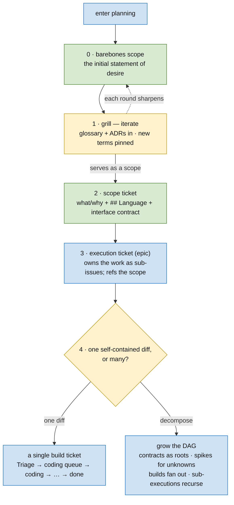
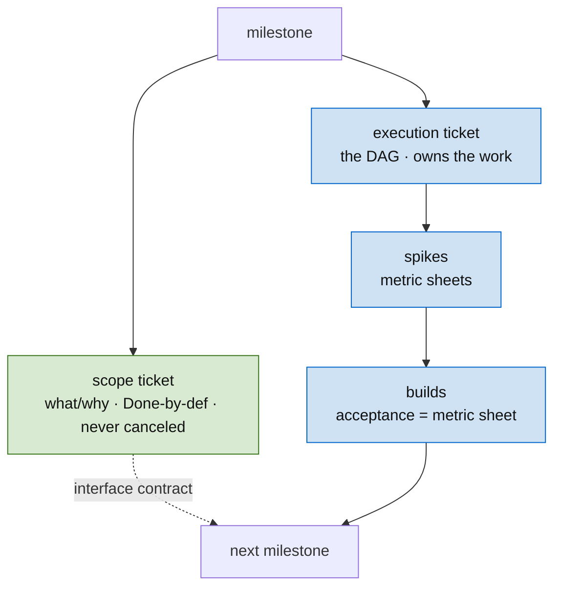

# Skill: Plan an Epic

**In one line:** break a goal into a dependency DAG of small tickets that run in parallel — language first, spikes for the unknowns, contracts frozen only on evidence.

A plan is a program. Tickets are functions, the DAG is the call graph, the contracts on the edges are the types, and **spikes are the evidence-gathering steps that resolve uncertainty before a contract is frozen.** Errors are contract violations between tickets — and most of them are preventable at plan time.

## Start here — the first moves

You don't open planning with a finished DAG — you open with a **first move**. The opening is fixed; the only fork is whether a DAG is warranted at all.



0. **Write the barebones scope** — the initial statement of desire, a few honest sentences of what and why. Don't demand more of it than honesty; it's the first draft, not the scope.
1. **Iterate it by grilling** ([grill](../grill/SKILL.md)). The durable records prior work left come *in* as the rubric — **scoping consumes the glossary and ADRs; it doesn't mint them** (the scope cites "per ADR-NNNN" instead of relitigating). What grilling pins fresh is the **new language** the work invents: a new term is a new domain concept — a candidate **newtype** ([strong-typing](../strong-typing/SKILL.md)). Iterate until the draft passes the **serves-as-a-scope test** ([scope-ticket](../ticketing/scope-ticket.md) → "When is scoping done").
2. **Finalize the scope ticket** ([scope-ticket](../ticketing/scope-ticket.md)): the canonical *what/why*, the `## Language` it leans on, and the **interface contract**. It's the milestone's single entry point (Done-by-definition once it has issues, never `Canceled`).
3. **Create the execution ticket** — the [execution epic](../ticketing/execution-ticket.md) that will own the work as sub-issues; it references the scope. Don't pre-draw its DAG.
4. **Decide: DAG or not.** Apply the build/execution boundary test — *small and self-contained enough for a subagent to execute from the ticket alone?* If **yes**, it's a single [build ticket](../ticketing/SKILL.md) and you're done planning. If **no**, it decomposes → grow the DAG: shared contracts as **roots** first, spikes for unknowns, builds fanned out, sub-execution tickets recursing. As builds resolve, **check each against the recipes you already have** — a build matching a "how we do X here" doc points at it instead of re-deriving the path ([recipe](../recipe/SKILL.md)). Reclassifying a build *up* into an execution ticket later is normal, not a failure.

The rest of this skill is **step 4's "decompose" branch** — how to grow that DAG well.

## When to use

When a goal spans multiple files, concerns, or days and needs to be broken into implementable units — a feature, a hardening pass, an infrastructure change. Not for a known one-diff change (that's a single build ticket; see the fork above).

## Inputs

| Input | Description | Example |
|-------|-------------|---------|
| Goal | What the user wants to achieve | "Every domain mutation lands in an append-only audit log" |
| Constraints | What must not break | "Existing write paths keep working throughout" |
| Domain context | External systems, APIs, data realities | the event bus's delivery guarantees, DB version, prior art |
| Existing work | What's already built that this builds on | the event bus, the existing writer call sites |
| Risk tolerance | What uncertainty forces a spike | "Spike anything that assumes all writers go through the bus" |
| Glossary + recipes | The durable records prior work left | `CONTEXT.md`, `docs/adr/`, the project's recipe docs |

## Output

- In Linear: a **scope ticket** + an **execution epic** for the milestone, the execution owning dependency-ordered spike and build tickets as children — all created in `Triage`; the human ratifies them onward.
- Side effects on the durable records: glossary entries for new terms, ADRs for decisions that pass the earn-it test, spike tickets for unknowns.

## Process

### 1. Identify the end state

What does the system look like when this epic is done? Not the steps — the destination. Write it as the epic's `## Goal`.

### 2. Work backwards from the end state

What's the last thing that must happen? That's the leaf. What does it depend on? Those are its `blocked_by`. Keep walking until you reach tickets with no dependencies — the roots.

### 3. Maximize fan-out

At every node ask: can any of these run in parallel? Two tickets with no data dependency and disjoint file writes can. The DAG should be **wide, not deep** — serial chains are bottlenecks.

### 4. Contracts at every edge

If A unlocks B, A's acceptance criteria pin exactly what B reads, in strong types — and A's `## Evidence` records *why* the contract has that shape, so a questioned contract starts from recorded reasoning. (`## Provides` / `## Consumes` mechanics → [ticketing](../ticketing/SKILL.md).)

### 5. Set the confidence prior per ticket

The planner's belief that the *contract* (not the implementation) survives contact with reality:

- `high` — every dependency typed and tested; the shape is constrained by upstream contracts.
- `medium` — default; reasonable but unverified.
- `low` — significant unknowns; **must be blocked by a spike**. Ratifying a `low` ticket into `coding queue` without one is a planning error.

### 6. Surface risks → spikes

Every ticket touching an external system, unstable API, or unproven assumption gets a `## Risks` section. Each risk maps to a **spike** (binary investigation → structured evidence), a **fallback** (degraded-but-acceptable contract), or a **replanning trigger**.

### 7. Close the open decisions — pin, spike, or ADR

A ticket holding a choice between approaches isn't ready. Either a spike resolves the choice (its evidence picks), or the decision is pinned in the ticket with the rationale in `## Evidence`. If the decision also passes the **earn-it test** (hard to reverse ∧ surprising without context ∧ a real trade-off), record it as an **ADR** too — see *Decision records* below.

### 8. Write tickets in dependency order

Roots first, then topological order, so downstream inputs can reference upstream outputs.

## Where the plan lives

The plan is two Linear descriptions, iterated in place. The **scope ticket** carries the what/why: `## Language` · decided shape · edges · the interface contract ([scope-ticket](../ticketing/scope-ticket.md)). The **execution epic** carries the how: `## Execution DAG` · `## The work` (each child linked, one-line scope) · `## Decision gates` · `## Exit` · `## Completion gate` · `## Status` ([execution-ticket](../ticketing/execution-ticket.md)). Dependencies are Linear blocking relations, derivable from the tickets' `## Provides`/`## Consumes`.

## Rules

- **Parallel by default — but pin before you parallelize.** If two tickets *can* run simultaneously the DAG *must* allow it — yet only across **pinned** edges. An unpinned load-bearing fact is a real dependency masquerading as nothing; one wrong fact parallelized-across becomes a cascade of failed tickets.
- **One decision per ticket.** Ambiguity in one ticket cascades into every downstream ticket.
- **Contracts at every edge; evidence travels with them.** A's `## Evidence` is a sufficient statistic for B — B doesn't re-derive A's reasoning.
- **Risks are first-class.** A plan without a risk section works until it doesn't.
- **Triage until ratified.** All tickets are created in `Triage`; only the human moves them onward (`coding queue` = ready to build).
- **Linear is the source of truth.** The scope and execution descriptions are the canonical documents — decide, argue, and iterate there, and update them in the same unit of work as any structural change.
- **A spike's evidence can be a re-runnable metric.** When the unknown is quantitative, the spike's deliverable is a metric sheet whose measuring command becomes the unlocked build's acceptance gate.
- **Diagrams are load-bearing, and many.** A plan renders from several lenses — for a plan, the **DAG** and **payoff** lenses are non-negotiable. If a facet is hard to draw, it isn't understood yet ([diagramming](../diagramming/SKILL.md)).

## Decompose over shared contracts (boundary-first)

Model the DAG over the **shared contracts** the work needs — what one unit produces and another consumes — not over files or features. The contract's *kind* varies with altitude; the machinery doesn't:

| Altitude | The shared contract is a… | Checkability |
|---|---|---|
| multi-service intent | capability / guarantee / behavior | judgment |
| service | API / protocol / event schema | semi-mechanical |
| subsystem | module boundary / interface | semi-mechanical |
| build (leaf) | type / struct / method | mechanical (diffs) |

Name each unit's `## Provides` and `## Consumes`, produce before consume, extract shared contracts as **early roots**, fan dependents out. **Type-first** is the leaf case: a known shared type is the most checkable contract — pull it out as a root and the integration-collision class disappears (a root can't be re-minted by two siblings). The anti-pattern is **feature-first sibling decomposition**: two siblings each mint their own copy of a shared structure and it fails at integration.

**When the contract isn't known yet, that's a spike — not a forced type.** And **cross-check produce vs consume as a required step**: diff every `Provides` against every `Consumes`. A consume with no producer is a **missing root**; a structure in two `Provides` is a **duplicate owner** — extract it as its own root, or fold it into its natural owner. Both are mechanical once both sides are declared.

## Spikes — evidence-gathering, not binary gates

A spike is a micro-experiment that gathers evidence about an unknown. Its output **updates the confidence prior** on the unlocked ticket — it doesn't just flip a pass/fail bit.

**A spike is an unpinned load-bearing fact.** A load-bearing fact must be pinned to reality — a permalink, a prior ticket's output, a recorded *"we looked and found X."* An unpinned one is a latent spike; the plan isn't done until every load-bearing fact is pinned or has a spike whose job is to pin it.

### Workflow

1. **Each unknown becomes a spike** (S-01, S-02, …).
2. **Order by ambition** — S-01 tries the ideal approach, S-02 the fallback. Stop at the first whose evidence locks the contract.
3. **Spikes produce structured evidence**, not "yes/no": what was tried, what was observed, what that implies for the contract — written into the unlocked ticket's `## Evidence`.
4. **Aggregate across spikes** bearing on one contract: S-02 inherits S-01's partial evidence and asks the next narrower question.
5. **Update the prior** — a pass usually moves `low → medium/high`; an uncovered constraint can move `medium → low` or trigger replanning.
6. **All spikes fail → the risk is a confirmed constraint.** Document it, replan downstream. That's the plan *working*, not failing.
7. **Spike code lives in `spike/<epic>/`** next to the code it probes, as standalone programs.

**Run spikes count-first, under an explicit token/effort ceiling.** Count before you read (grep/ast-grep for counts + file lists; 1–2 excerpts per category, never whole files); sub-investigations return the metric sheet, not file dumps; stop-and-report if the ceiling nears without convergence. A spike is bounded discovery, not implementation.

### Spike ticket format

A child of the execution epic, titled `S<N> · Spike: <question>`, with a Linear blocking relation to each build its evidence defines. Description:

```markdown
## Question
Does any production path disable, deactivate, or delete a user across
cm_common and the graph — i.e., does this milestone need a cross-store
lifecycle/invalidation design at all?

## Setup
Count-first sweep of handlers + migrations for user-state mutations
(grep/ast-grep for UPDATE/DELETE on users + status/disable fields);
read 1–2 call sites per category found.

## Pass condition
Binary: at least one live path mutates user lifecycle state — yes or no.

## Evidence to record (regardless of outcome)
- Which stores hold user state; which fields imply lifecycle
- Any admin/back-office path that touches them
- What invalidation a future disable would require

## Fail → consequence
No path mutates lifecycle → user is create-once + immutable for this
milestone; the lifecycle build is descoped, recorded on the scope ticket.
```

**Key rule:** the pass condition must be binary — a spike needing a judgment call isn't a spike. But the *evidence* is structured prose, and that's what downstream conditions on.

### Spike evidence as a metric sheet

When the unknown is quantitative — *how big, where, does this hold codebase-wide* — the evidence is a **metric sheet**: `metric → current (measured) → target → the command that measures it`. The measuring command becomes the unlocked build's acceptance gate; re-running it is the build's regression test. Evidence and acceptance criteria collapse into one artifact, and the spike **defines its build 1:1**. If a finding can't be written as a metric with a command, the investigation isn't finished.

## Decision records (ADRs)

Some decisions outlive the epic that made them. Those live in the worked-on repo at **`docs/adr/NNNN-slug.md`** — sequential numbering (scan for the highest, increment), so they're **citable** from tickets, reviews, and `## Evidence` ("per ADR-0007").

**The earn-it test — all three, or skip it:**

1. **Hard to reverse** — changing your mind later costs something real.
2. **Surprising without context** — a future reader would wonder "why on earth is it this way?"
3. **A real trade-off** — genuine alternatives existed and one was picked for reasons.

The template is deliberately tiny — 1–3 sentences: context, decision, why. Optional `Status` / `Considered options` / `Consequences` only when they earn their lines. Qualifying examples: a service-boundary rule ("identity resolves at the user-service boundary; org never resolves identity"), a technology choice with lock-in, a deliberate deviation from the obvious path, a constraint invisible in the code.

ADRs are minted two ways: **live**, when a decision crystallizes during grilling/planning and passes the test; and — the main road — by the **distill pass within execution**: a *distill node* over the execution graph (the whole graph, or any closed sub-section), run mid-execution as tracks close and **always before the execution is concluded complete** ([execution-ticket](../ticketing/execution-ticket.md) → "Distill nodes"). **Scoping doesn't mint ADRs — it consumes them**: the next scope reads the records and cites "per ADR-NNNN" instead of relitigating. They're one of the three **durable records** ([methodology](../methodology/SKILL.md) → "Durable records"): the glossary holds the *language*, ADRs hold the *decisions*, recipes hold the *procedures*. Execution-ticket decision gates still record `DECIDED: …` + evidence as always — an ADR is for the subset a future stranger must find *without* reading this epic.

## The milestone in Linear

**Linear is the source of truth — the plan lives in the tickets and is iterated there.** Each milestone gets two ticket kinds:

- **Scope ticket** — the canonical, always-current view: the *what/why*, the language, the interface contract. The milestone's single entry point, diagram-led. **Done by definition — but only once it has produced ≥1 work issue**; **never `Canceled`** (this is a living reference, not abandoned work). Format → [scope-ticket](../ticketing/scope-ticket.md).
- **Execution ticket** (an epic) — holds the DAG and **owns the work as sub-issues**; in-progress until the flow is defined, then advances as builds land. Format → [execution-ticket](../ticketing/execution-ticket.md).



**State conventions:** scope → `Done` on its first child, never `Canceled`; execution → in-progress while the flow forms; spike → `Done` once it has a *result* ("a decision is still needed" is a valid result — the open decision then rides on the build the spike defined); build → queued, wired by explicit blocking links; superseded work → `Canceled` **with a pointer**, never silently dropped.

**Restructure cleanly when the model shifts.** A concept earning its own milestone, or a decision re-partitioning the work, is the calibration loop firing — expected. Extract the new milestone, sweep *every* affected doc and ticket, re-file work, cancel duplicates with supersession pointers.

**Human ratifies at the forks; the agent sweeps the mechanics.** Substantive Linear writes (new tickets in a real project, cancellations, milestone boundaries) are proposed for approval; the mechanical sweep (renames, re-files, bulk creation) fans out to subagents. And **verify against live state**: re-derive from Linear + the code, not forwarded prose; mark inferences `[confirm]`.

## When built work is removed or superseded

When a build is dropped — a decision re-partitioned the work, a review obsoleted it, two builds collapsed — propagate the removal **in the same unit of work**:

1. **Strike the node, collapse the DAG.** Re-base its dependents onto its surviving predecessor; apply transitive reduction.
2. **Carry the *why* into the survivor.** The replacement's `## Evidence` records what it subsumed; the removed ticket goes `Canceled` **with a pointer** to its replacement.
3. **Re-confirm Exit + Completion gate.** If the removed build was the only producer of a consumed contract, that consume is now a **missing root** — resolve before closing.

(The every-direction statement — adds, removals, re-sequencing — is [execution-ticket](../ticketing/execution-ticket.md) → "The DAG is live".)

## Sub-projects when a milestone reveals itself as a program

When a milestone turns out to contain its own DAG — its own roots, leaves, spike candidates — don't scope-creep it. **Promote it to a child planning project** with its own overview and tickets, linked bidirectionally with the parent (the parent lists it under "Sub-projects"). Each level stays at its native granularity, and the parent's confidence prior on that milestone stays meaningful instead of quietly growing into a multi-quarter epic tracked nowhere.

## The status-check ritual

For any multi-week effort, a periodic (weekly) check on three questions:

1. **Where are we?** Done / pending / in progress.
2. **How is the direction captured?** Which artifacts, where, findable cold.
3. **Where are the gaps?** Discussed but not persisted.

The third is the load-bearing one — conversation-state and artifact-state diverge constantly, and only artifacts survive context decay. The output is a one-paragraph note appended to the execution ticket's `## Status`; the gaps it surfaces become tickets, decisions, or description patches in the same pass.

## Calibration — closing the loop

At epic close (last build PR'd), spend five minutes:

- Which `low`-confidence tickets needed contract revision after their spike? (Correctly low.)
- Which `low` tickets passed first try? (Over-hedged.)
- Which `high` tickets needed mid-flight revision? (Under-hedged.)
- What was the most expensive surprise — and did any upstream `## Evidence` hint at it?

Record a one-line takeaway at the bottom of the execution ticket. You are systematically biased in some direction; explicit calibration shrinks the bias over epics.

**Calibration's other output: recipes.** Tuning priors is the inward half. The outward half: when the epic contained a recurring task whose path was non-obvious, **distill a recipe** — the wrong assumptions and fixes recorded across the execution become a "how we do X here" doc the next plan consults → [recipe](../recipe/SKILL.md). In a planned DAG this runs as the gate-side **distill node** feeding the completion gate — ticketed, with its input segment named — not an offline ritual ([execution-ticket](../ticketing/execution-ticket.md) → "Distill nodes").

## Examples

**Good first move** (language → scope → fork):

> Key terms: *audit event* (the immutable record of one mutation), *actor*, *writer* — three distinct concepts; glossary updated, `AuditEvent` and `ActorRef` flagged as new newtypes. Scope ticket drafted with the interface contract. The work is clearly multi-diff (a new event type, writer adoption, a retention job) → decompose: `AuditEvent` is the shared contract every branch consumes, so it's the first root.

**Bad first move** (straight to a ticket pile):

> Tickets: 1. Add audit table. 2. Update the writers. 3. Fix retention. 4. Cleanup.

(No language pass — "audit" stays ambiguous across three meanings. No scope, no contracts on the edges, no spikes for the unknowns, and the "tickets" are a serial chain of vague verbs no stranger could verify.)

## Pointers

- Ticket formats, status values, `## Provides`/`## Consumes`, evidence: `../ticketing/SKILL.md` (+ `scope-ticket.md`, `execution-ticket.md`)
- The interrogation that opens planning (glossary + ADRs): `../grill/SKILL.md`
- Recipes — consult at step 3, produce at calibration: `../recipe/SKILL.md`
- Strong typing in contracts: `../strong-typing/SKILL.md`
- The operating shape this slots into: `../methodology/SKILL.md`
- Diagram lenses: `../diagramming/SKILL.md`
