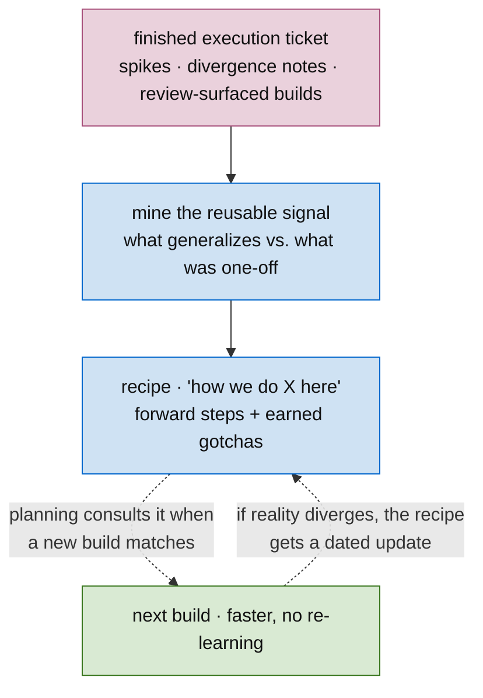

# Skill: Distill a Recipe

**In one line:** turn the record of how a build *actually went* — the wrong turns, the spikes, the things review sent back — into a "how we do X here" doc, so the next agent skips straight to the answer.

The first time you write a graph migration in CM2, the agent burns real effort: it makes an architectural mistake, forgets the migration must be idempotent, doesn't realize it needed the data fetched up front. The execution ticket records every one of those wrong turns and how they got resolved. A **recipe** is that record, distilled forward: not *what happened*, but *how to do it right the first time* — with each gotcha carrying the evidence that earned it.

This closes the methodology loop the *other* way. [Calibration](../planning/SKILL.md) adjusts confidence priors; a recipe produces a **reusable artifact**. Shipping stops being a one-way street.



## When to use

Two triggers — one looking back, one looking forward:

- **Retrospective (write one).** A build or execution just landed, and the work was an instance of a **recurring task type** — something you'll do again (a DB migration, a new graph node, a gRPC handler, a wire-boundary newtype pass). The path was non-obvious: the agent made a wrong assumption, a spike produced an answer that generalizes, a review surfaced a build that should have been planned, or you settled a coding style. That non-obvious path is the recipe. In a planned DAG this runs as the gate-side **distill node** feeding the completion gate — ticketed, its input segment named ([execution-ticket](../ticketing/execution-ticket.md) → "Distill nodes") — not an offline ritual. **The input need not be an execution graph**: a strictly **agent-bound task** — an orientation, a tracker sweep, a landing-shape audit — whose path took non-obvious turns distills the same way (`per ADR _common/0004`).
- **Prospective (consult one).** You're planning a DAG and a build matches a task you have a recipe for. Point the build at it — the agent reads "how we do X here" instead of re-deriving it. This is the payoff; a recipe nobody consults was wasted effort.

**Don't write a recipe when:** the work was a one-off (it won't recur), the path was already obvious, or the lesson is specific to this one feature (that's `## Evidence` on the ticket, not a recipe). A recipe earns its existence by being **reused**.

## Inputs

| Input | Description | Example |
|-------|-------------|---------|
| Finished execution ticket | The history to mine — its DAG, spikes, decision gates, divergence notes, and any builds that surfaced from PR review | `CMD-401` (M2a · user identity foundation) |
| Recurring task type | The thing this work was an instance of, that you'll do again | "add a graph node", "write a relational migration" |
| Where recipes live | The project's skills/docs area a future plan will look in | the worked-on repo's `.claude/skills/` (e.g. `app-cm`) |

## Output

A **recipe doc** — a focused "how we do X here" file. Two homes by what the task is bound to: **project-bound** recipes land in the worked-on repo's skills area; **agent-bound / method-bound** recipes (running the method itself, independent of any codebase) land in this repo's [`docs/recipes/`](../../docs/recipes/README.md), scoped `_common/` + `<github-username>/`. Shape:

```markdown
# How we <do X> in <project>

<one-line: when this recipe applies>

## Steps
1. <forward step>
2. <forward step> …

## Gotchas (each earned)
- <rule> — *earned by:* <the wrong-turn / spike / review that taught it> (<ticket/PR link>)

## Divergence notes
*(append-only — when a later build diverges, record what and why)*
```

The recipe is **forward** (a procedure to follow), not a narrative (what happened last time). The history is the *source*; the recipe is the *distillate*.

## Process

### 1. Confirm it recurs

If this task type won't come up again, stop — it's not a recipe. Recurs? Continue.

### 2. Mine the history for reusable signal

Walk the finished execution ticket and pull the parts that generalize. The richest seams:

| Seam in the history | What it yields |
|---|---|
| **Spike answers** | A spike whose conclusion is true beyond this feature ("the env is PG 16.8; native `uuidv7()` lands in PG 18") is a recipe fact. |
| **Divergence notes** | Where reality broke the initial design is exactly where the next agent will trip — promote it to a gotcha. |
| **Review-surfaced builds** | A build that had to be *added* from a PR review (a concurrency guard, a typed codec) is a thing the first pass missed — name it so the next pass doesn't. |
| **Decision gates** | A `DECIDED:` with its evidence is a settled choice future work shouldn't relitigate — bake the decision in. |

### 3. Separate reusable from one-off

For each candidate: *would this be true for the next instance of this task, or only for this feature?* General → recipe. Feature-specific → leave it as `## Evidence` on the ticket. A recipe diluted with one-off detail stops being a shortcut.

### 4. Write it forward, with each gotcha earned

State the procedure as steps to follow next time. Then, for every gotcha, **carry the evidence** — the same belief-state discipline as a ticket's `## Evidence`: name the wrong-turn, spike, or review that earned the rule, with a link. "Migrations must be idempotent — *earned by:* CMD-XXXX re-ran in staging and double-applied" beats a bare "make migrations idempotent" a reader has no reason to trust or remember.

### 5. Land it where it'll be found, and wire it

Put the recipe in the project's skills/docs area. Then **link it from the work that should consult it** — so a future plan, hitting a build of this type, points the build at the recipe (the prospective trigger). A recipe that isn't wired in won't get reached for.

### 6. Keep it live

When a later build diverges from the recipe, append a dated `## Divergence notes` entry (never edit prior ones) — same append-only liveness as a ticket's `### Divergence notes`. Repeated divergence is a signal the recipe itself is wrong and wants a rewrite.

## Rules

1. **A recipe is earned, never invented.** Every rule traces to a real wrong-turn, spike answer, or review finding in some execution history. No speculative best-practices — those are someone else's blog post, not your house recipe.
2. **Forward, not retrospective.** The reader wants "how to do it," not "what we did." Distill the history into a procedure; don't paste the history.
3. **Evidence travels with the gotcha.** Each rule names the failure that earned it, with a link. The *why* is what makes a reader trust and retain it — and what lets a future agent overrule it when the context has changed.
4. **Reusable, not one-off.** If it's only true for this feature, it's `## Evidence` on the ticket. A recipe is the intersection across instances of a task type.
5. **Consulted at planning time, or it was wasted.** Wire the recipe into the work that should reach for it. The payoff is the *prospective* trigger — a build that reads the recipe instead of re-learning it. An unwired recipe is dead weight.
6. **Keep it live (append-only).** Divergence is recorded, not edited over. Repeated divergence means the recipe is stale — rewrite it.
7. **Recipes land where the next runner will look; this skill is the house practice.** The recipe *skill* (this doc) is methodology and lives here. Project-bound recipes land in the worked-on repo's skills — where the next agent on that code will find them. Agent-bound / method-bound recipes land in this repo's [`docs/recipes/`](../../docs/recipes/README.md) — where the next *session* will find them (`per ADR _common/0004`).

## Examples

**Good recipe seed** — distilled from `CMD-401` (M2a), "How we add a graph node in CM2":

> 1. Build the node from the **canonical id only** — it references `cm_common`'s `user_uuid`; it does **not** carry auth claims (`sub`/`connection`) or tenant as node properties.
> 2. Resolve identity at the **owning service's boundary**, never inside the graph repo.
> 3. Type the vertex with a **codec** (`toProps`/`fromProps`) — one place graph keys live.
> 4. Guard **first-contact mint** (it's check-then-act, the house pattern) with a per-entity advisory lock held at the **service boundary**.
>
> **Gotchas (each earned):**
> - Don't resolve `connection → tenant` inside org-service — *earned by:* B6 (#975) did, re-crossing the very boundary M2a exists to fix; corrected by B7 (CMD-407).
> - Don't read the node with untyped `map[string]any` props — *earned by:* #975 review surfaced it; fixed by the typed codec in B6.1 (CMD-412).
> - Put the mint lock at the user boundary, **not** in the graph repo — *earned by:* doing it in the repo would recouple org-service → cm_common, undoing B7. Sized as B8 (CMD-409).

(Every rule is forward, every gotcha names the build/review that earned it and links it. The next agent adding a graph node skips three mistakes M2a had to make.)

**Bad recipe:**

> Graph nodes are an important part of the system. Be sure to model them carefully and add tests. Follow best practices for concurrency.

(Generic, nothing earned, nothing traceable, nothing the reader couldn't have guessed. It compresses no hard-won knowledge — so it saves the next agent nothing.)

## Pointers

- The loop this closes: `../methodology/SKILL.md` → "The method feeds itself"
- The durable-records family (glossary · ADR · recipe — siblings with earn-it gates): `../methodology/SKILL.md` → "Durable records"; the point-decision sibling is the ADR (`../planning/SKILL.md` → "Decision records"), minted by the same execution-side distill pass (`../ticketing/execution-ticket.md` → "Distill nodes")
- Where recipes are born (calibration at epic close) and consulted (planning a matching build): `../planning/SKILL.md` → "Calibration" and "Start here — the first moves"
- The append-only liveness pattern it borrows: `../ticketing/SKILL.md` → `## Intended Usage` / `### Divergence notes`
- The evidence-travels-with-the-value principle: `../../AGENTS.md` → "Methodology — Agentic Development" (linguistic belief state)
- Example execution ticket to mine for reference: `CMD-401` (M2a · user identity foundation, fictional)
