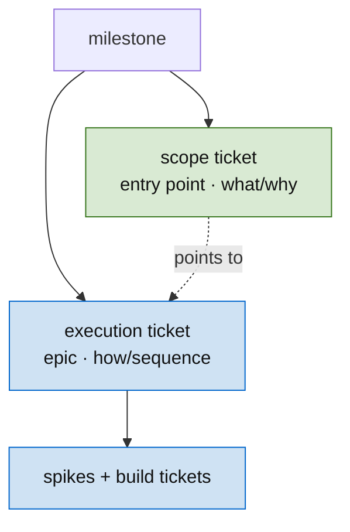

# Skill: Write a TDD Ticket

A ticket is a sufficient statistic for the next agent in the chain. It carries forward not just **what** to build, but the **evidence** that justifies the contract — so when the contract is questioned later, the rationale is in the file, not in someone's head.

The binding constraint is the **two-stranger test**: two agents who have never spoken — one implementing, one verifying — can independently agree on Done using only the ticket text.

## When to use

When the user asks to ticket work, plan a feature, or write acceptance criteria. Also invoked implicitly when any epic needs to be broken into implementable units.

## Ticket kinds — build vs scope vs execution

Three kinds, three shapes. **This document is the *build* ticket** — the implementation unit that passes the two-stranger test (everything below: Inputs, Body sections, Rules, the integration gate). The other two have their own format docs:

| Kind | What it is | Format |
| -- | -- | -- |
| **Build** | one implementation diff | **this document** |
| **Scope** | the canonical *what/why* of a milestone; its single entry point | [`scope-ticket.md`](scope-ticket.md) |
| **Execution** | the *how/sequence*; an epic holding the DAG and owning the work | [`execution-ticket.md`](execution-ticket.md) |

In a `plans/` directory the scope and execution content can collapse into the single epic overview (`-1`); in a live tracker (Linear, etc.) they split into two tickets. All three kinds are **diagram-led** — lead with the diagram that carries the shape (see [diagramming](../diagramming/SKILL.md)). Their *lifecycle & state* rules live in [planning](../planning/SKILL.md) → "Projecting the plan into a live tracker"; the body **formats** live in the per-kind docs above.



## Inputs

| Input | Description | Example |
|-------|-------------|---------|
| Problem description | What gap, bug, or capability is missing | "Activations can't see caller identity" |
| Domain context | External APIs, crate APIs, or domain knowledge needed | jsonrpsee 0.26 connection extensions, cookie validation flow |
| Upstream tickets | What this ticket depends on (their `unlocks` includes this id) | AUTH-2 must be Complete |
| Downstream consumers | What tickets will read this ticket's output | AUTH-7 reads `AuthContext` shape |
| Confidence prior | How sure the planner is the contract is achievable | `high` if all dependencies are typed and tested; `low` if a spike is needed first |

## Output

A markdown file at `plans/<EPIC>/<EPIC>-<N>.md` with YAML frontmatter. **Status is always `Pending` on creation** — Claude must never set a ticket to `Ready` on creation. Promotion to `Ready` requires human approval: either the user edits the file themselves, or the user explicitly grants Claude permission to flip the status (e.g., "promote these to Ready", "you have permission to mark X as Ready"). Without explicit permission, Claude leaves status at `Pending`. Implementation must not begin on `Pending` tickets.

## Directory convention

```
plans/                           # Top-level: cross-crate epics
  <EPIC>/
    <EPIC>-1.md                  # Epic overview (type: epic)
    <EPIC>-2.md                  # Individual ticket
    <EPIC>-3.md
<crate>/plans/                   # Per-crate epics that don't span repos
  <EPIC>/
    <EPIC>-1.md
```

`<EPIC>` is a short prefix (e.g., AUTH, IDN, STF). `<N>` is sequential within the epic. The epic overview is always `-1`. Top-level `plans/` is the default; use a per-crate `plans/` directory only when the epic genuinely doesn't escape one crate.

## Frontmatter

```yaml
---
id: EPIC-N
title: "Short description"
status: Pending
type: implementation        # implementation | analysis | spike | epic
blocked_by: []
unlocks: []
confidence: medium          # high | medium | low (optional, default medium)
severity: Medium            # Critical | High | Medium | Low (optional)
---
```

### `confidence` field

The planner's prior on whether the contract as written is achievable as written. Updated by spike outcomes (see `planning` skill). Concrete meaning:

| Value | Meaning | Implication |
|-------|---------|-------------|
| `high` | All dependencies are typed and tested. The shape is constrained by upstream contracts. | Implementation can proceed directly once Ready. |
| `medium` | Default. The shape is reasonable but unverified against the real system. | Implementor should sanity-check assumptions early. |
| `low` | Significant unknowns. The contract may need revision once reality intrudes. | Spike first. Do not flip to Ready until a spike has updated confidence to `medium` or `high`. |

Confidence is *not* time estimation. It's the planner's belief that the *contract* (not the implementation) survives contact with reality.

## Status values

| Value | Meaning | Who sets it |
|-------|---------|-------------|
| `Idea` | Captured but the contract isn't writable yet — open design questions remain | Claude or human |
| `Pending` | Contract written, awaiting human review | Claude (on creation) |
| `Ready` | Approved, no blockers, ready for implementation | Human (directly, or Claude with explicit permission) |
| `Blocked` | Approved but waiting on `blocked_by` tickets | Human or Claude |
| `Complete` | Implemented: gate green, committed, **PR open** (handed to the pipeline) — not merged/shipped | Implementor (status flips with the code) |
| `Epic` | Overview document, not a unit of work | Claude (on epic creation) |
| `Superseded` | Absorbed by another ticket (see `superseded_by` field) | Claude or human |

`Idea` vs. `Pending`: an `Idea` cannot be promoted to `Ready` without first being rewritten as `Pending` with the open questions resolved. A `Pending` ticket has a complete contract that the human is being asked to ratify.

## Body sections

```markdown
## Problem
One paragraph. The gap, the bug, the missing capability.

## Context
(Optional) External API shapes, domain knowledge, crate API refs.
NOT implementation instructions. This is the terrain, not the route.

## Evidence
The reasoning that justifies this contract. Why this shape and not another?
What spike result, prior ticket, or external constraint pinned the choice?
This is the sufficient statistic downstream tickets and reviewers condition on.

## Required behavior
Input/output tables. Observable behaviors. "When X, then Y."
No code. No SQL. No file paths.

## Provides (the output contract)
The **producer side** of the dependency edge: the named artifacts this ticket *adds to the system* that other work depends on. A table — each output, its strong-typed shape, and its consumer:

| Output | Shape (strong-typed) | Consumed by |
| -- | -- | -- |
| `ResolveLoginIdentity` RPC | `(Sub, Connection) → LoginIdentity` | B1 cutover · M2b people-page |
| `users.user_uuid` column | UUID v7, NOT NULL, immutable | RBAC keyed by UUID (M2b) |

- Name **everything a downstream ticket or subticket reads** — a new type, function, endpoint, migration, column, file, config key. If something depends on it, it belongs here.
- "Consumed by" is a **known subticket / downstream ticket**, or "available — no consumer yet." The `unlocks` frontmatter and any subtickets' `blocked_by` must be **derivable from this list**.
- Pairs with `## Intended Usage`: **Provides = *what* is added; Intended Usage = *how* to wield it.** Acceptance pins each provided shape; `## Evidence` records *why* it has that shape.

## Intended Usage
How the next consumer is expected to call the thing this ticket produces.
The construction shape, the typical call site, the abstraction boundary,
what counts as a misuse. Distinct from Required behavior (which specifies
the contract) and Acceptance criteria (which verifies correctness) —
this is the consumer's-eye view.

Includes an APPEND-ONLY `### Divergence notes` subsection. When reality
diverges from the initial design, add a dated entry naming what's actually
used and why. Existing entries are never edited; corrections become new
entries. The section is a usage changelog living on the ticket.

## Risks
(Optional) Places where the output might not be achievable.
Each risk maps to a spike, a fallback, or a replanning trigger.

## What must NOT change
Regression criteria. Existing behaviors that must survive.

## Acceptance criteria
Numbered items. Each checkable by running a command, reading a
response, or counting rows. No criterion requires reading source
code to evaluate.

## Completion
What the implementor delivers: test command + output, status flip.
```

The `## Evidence` section is the BLF-style sufficient statistic. When a downstream ticket reads "AUTH-2 unlocks me," it should be able to look at AUTH-2's Evidence section and understand *why* the `AuthContext` struct has the fields it does, so that if AUTH-2's contract is questioned, the conversation starts from the recorded reasoning rather than restarting from scratch.

## Rules

1. **One decision per ticket.** Multiple options = not ready = write a spike instead.
2. **Specify behavior, not code.** Use input/output tables.
3. **No implementation in acceptance criteria.** Criteria describe what the system does, not how.
4. **State what does NOT change.** Regression criteria are as important as new behavior.
5. **Scope is one diff.** Multi-repo changes that can't be tested together = split.
6. **Verification is high-level.** "Run tests; they pass." Not "grep for this string."
7. **Fixtures are committed.** If criteria reference a test fixture, it exists in the repo.
8. **Downstream tickets can read the contract.** If ticket B depends on A's output, A's criteria pin the shape AND A's `## Evidence` records why.
9. **Strong types in contracts.** Reference `AuthContext`, not "a struct with user id and roles." See `strong-typing` skill.
10. **Concurrency is file-bounded.** Two tickets that *write* the same file cannot run in parallel — they collide at commit time, regardless of `blocked_by`. When planning, check file boundaries across tickets in addition to logical dependencies. Reading the same file is fine; writing is not. This is a **merge mechanic**, distinct from the *dependency* model: dependencies are modeled over software structures — a build consumes a type/interface another produces (see [planning](../planning/) → "Decompose type-first") — not over which files happen to overlap.
11. **Split tickets along file boundaries to expose parallelism.** A single ticket modifying multiple independent files is a serial chain disguised as one unit. Split into per-file units so the pieces can be implemented concurrently.
12. **Intended usage is a required section, divergence is append-only.** Every implementation ticket includes `## Intended Usage` describing how the next consumer calls the thing produced — the canonical wielding shape. When reality diverges (an unforeseen call site, a contract that needed loosening, a consumer that bypassed the abstraction), append a dated `### Divergence notes` entry stating what's actually used and why. Never edit prior entries; corrections become new entries. The section becomes a usage changelog and a calibration signal — repeated divergences in similar tickets mean the original design heuristic is wrong, and the planner should adjust priors.
13. **Diagram over prose.** Lead the ticket with the diagram that carries its contract/shape; prose is the fallback for what a diagram can't say (rationale, caveats). A ticket that's all prose usually hasn't been understood *as a shape* yet — and two strangers agree on a shape faster from a diagram than from two paragraphs, which is exactly the two-stranger test this skill is built around. See the [diagramming](../diagramming/SKILL.md) skill.
14. **An unsatisfiable contract is a ticketing failure — patch, don't paper over.** If you can't meet the ticket's stated intention because an assumption it rests on didn't hold (a version / environment / API / data constraint discovered mid-build), stop at that boundary — don't silently substitute a different approach. Patch the ticket with the finding and surface it. See "When the ticket can't be built as written".
15. **Declare the output contract (`## Provides`).** Every ticket that *adds* something a downstream ticket or subticket depends on lists it under `## Provides` — named, strong-typed, with its consumer. The `unlocks` edges and any subtickets' `blocked_by` must be **derivable** from it; a dependency that lives in the DAG but in no ticket's `## Provides` is an unstated contract — the failure Rule 8 guards, made explicit on the producer side. **Enforce this hardest at the milestone level:** a milestone's output contract is its scope ticket's *Interface contract* — the edge whole milestones hang off, so an unstated or sloppy one there cascades furthest.
16. **A build is a leaf only if a subagent can do it from the ticket alone.** If a build turns out too complex and needs breaking up, it's an execution ticket in disguise — **promote it** to its own execution ticket and let its sub-tickets take over. The build/execution boundary is *sized by* "can one agent do this directly from the ticket?", reassessed on contact — not fixed at planning.
17. **Link the PR directly.** When a ticket has a pull request, attach it as a first-class link on the ticket — the tracker's PR/attachment field, or the commit/PR reference in `## Completion` for a `plans/` directory — **never only a prose mention buried in the body**. A reviewer or downstream agent must reach the diff in one click, and a linked PR lets the tracker surface its state (draft / open / merged) on the ticket. One ticket's work can span several PRs and one PR can close several tickets; link **every** PR↔ticket edge that exists, not just the first.

## Integration gate (the rule for `Complete`)

A ticket reaches `Complete` only when the workspace it touches builds and tests green, end-to-end. Specifically:

- Every ticket's acceptance criteria must include "`cargo build` and `cargo test` (or workspace-language equivalent) pass green for the affected workspace."
- A ticket can be `Ready` while pre-existing issues block the gate, but it stays `Ready` — not `Complete` — until the gate passes.
- If pre-existing issues prevent the gate from ever passing as-is, write a dependency ticket that fixes the blocker and add it to `blocked_by`.

**`Complete` is the author's finish line, not the work's.** It means *implemented + handed to the pipeline as an open PR* — green, committed, PR'd. **Landing** (merge → review → QA → ship) is the pipeline's, tracked by the live tracker's states, **not** by `Complete`; a `Complete` build is not yet shipped. How the PR is shaped within the DAG → [execution-ticket](execution-ticket.md) → "Realizing the DAG as PRs".

**Why this is a rule and not a guideline.** Downstream tickets condition on "Complete" meaning "the workspace is in a shippable state." That assumption cascades into later epics' promotion decisions. A `Complete` ticket whose workspace is red is a contract violation that infects every consumer.

**Pre-existing blockers.** If ticket A's own work is done and committed but a separate pre-existing issue prevents the workspace from building, A stays `Ready`. File a ticket B that fixes the blocker, add B to A's `blocked_by`. When B lands, retry A's acceptance criteria — if green, flip A to `Complete`. A and B can ship in a single commit run if the implementor batches.

**Retrofit policy.** If a past ticket was flipped to `Complete` without the gate passing, flip it back to `Ready`, add the missing `blocked_by`, and carry it through cleanly. History gets a small correction; future tickets avoid the same error.

## When the ticket can't be built as written (a ticketing failure)

The integration gate is the *success* boundary. This is the *failure* boundary: mid-implementation you discover the ticket's intention can't be satisfied because an assumption it rests on doesn't hold — a dependency version, an environment limit, an API that doesn't expose what was assumed, a data reality that breaks the approach. **That is a ticketing failure** — the contract encoded an assumption that was never verified (usually a spike that should have run). Owning it as a *ticket* failure, not an implementation inconvenience, is what stops the next agent from rediscovering it cold.

**How far to go — the boundary:**
- **In-contract adaptation → proceed, then note it.** If the fix is an implementation detail that doesn't change what the ticket promises or what downstream consumers read, make it and record it in `### Divergence notes` (Rule 12).
- **Out-of-contract → stop.** If satisfying the intention now requires a *different approach* than specified, changes the shape downstream conditions on, or breaks the user-visible intention — **do not silently work around it.** A workaround that quietly redefines the contract is worse than a blocked ticket: it ships an unannounced change every consumer reads as correct.

**Patch the ticket with the findings — always, before proceeding:**
1. Append to `## Evidence`: the exact constraint (version, error, link) and *which intention it defeats*.
2. State the options: a **fallback** contract that's still in-appetite, a **spike** to choose between options, or a **replanning trigger** if it ripples downstream (`../planning/SKILL.md` → Risks → Spikes).
3. Re-shape or escalate: if a fallback is obvious and in-appetite, rewrite the contract and **leave the ticket `Ready` for the human to re-confirm** — an agent doesn't self-approve a contract change. If it ripples, kick it back to planning.
4. Calibrate: a constraint found at implementation time is almost always a **missed spike** — the `confidence` should have been `low`. Note it so the planner adjusts priors (planning → Calibration).

**Worked example.** A build ticket assumes DB-native UUIDv7 (Postgres 18). At implementation the environment is Postgres 16.8 — no native `uuidv7()`. The intention "the DB mints a v7 id" is unsatisfiable as written → ticketing failure. **Don't** quietly fall back to `gen_random_uuid()` (v4) — that violates the v7 requirement downstream reads. **Do:** patch the ticket — *Evidence:* "PG 16.8; native `uuidv7()` lands in PG 18"; *options:* "(a) generate v7 in app code, (b) add a v7 SQL function/extension"; pick the in-appetite fallback, rewrite acceptance to name it, leave `Ready` for re-confirm. The next agent sees the constraint and the chosen path — not a v4 surprise.

**Cascade.** If the incorrect fact would also break *other* tickets, then this ticket was a **dependency** of all of them — and they **should not have been optimistically started** before it was confirmed. A cascade is the symptom of an unpinned load-bearing fact that got parallelized across (planning → "pin before you parallelize"). When it happens: stop the dependent work too, patch the shared finding once, and re-sequence so the dependency is confirmed first.

## When built work is removed or superseded (archive before you delete)

Rule 14 handles a contract that *couldn't* be built. This is the inverse: a contract that **was** built — committed, maybe merged — then **un-shipped** because a simpler approach won, scope changed, or an assumption flipped after the code already existed. The failure mode is **erasing the work and its reasoning together**, so a future agent rebuilds the removed thing or hunts for "where did X go."

**Archive before you delete.** Tag the commit that still contains the built work with an `archive/<name>` git tag and push it, *then* remove the code in a normal commit. The tag makes the work recoverable without leaving dead code on the branch — "removed, not lost."

**Leave the paper trail on the tickets — don't silently close them:**
- Move each superseded build to `Superseded` (or the tracker's canceled state) with a closing comment naming **(a)** the archive tag, **(b)** the removal/swap commit, and **(c)** the ticket that now carries the work (`superseded_by`).
- Update the **execution ticket's DAG** to the collapsed shape — strike the removed sub-builds, show what remains — so the epic reflects reality at a glance.
- Carry the *why* (the decision that un-shipped it) into the surviving ticket's `## Evidence` / `### Divergence notes`, not only the closing comment.

The chain a future agent must reconstruct from the tickets alone: **built → archived at `<tag>` → removed in `<commit>` → folded into `<ticket>`, because `<reason>`.**

**Worked example.** A relational Go-migration runner + harness + backfill (B2.2 / B2.3) were built, then the team chose a single DB-side `ADD COLUMN ... DEFAULT gen_random_uuid()` migration instead — no runner needed. The built work was tagged `archive/m2a-go-dbmigrate` and pushed, then removed in one commit; B2.2 / B2.3 / B2.4 were moved to Canceled, each with a comment linking the tag + the removal commit + the surviving migration ticket (B2.1); the B2 execution DAG was collapsed to just B2.1. The runner stays recoverable from the tag if a future data migration needs it. (This is also the endorsed end of the Rule 14 "in-appetite fallback, human-confirmed" path — the v4 fallback was *chosen and recorded*, not silently substituted.)

## Meta-acceptance criteria (check before writing to disk)

- [ ] Two-stranger test passes
- [ ] No open design decisions
- [ ] `## Evidence` section present and load-bearing
- [ ] `## Intended Usage` section present, with a concrete consumer-flow description and an empty `### Divergence notes` subsection ready for append
- [ ] Acceptance criteria are observable
- [ ] Fixtures are committed (or described precisely enough to create)
- [ ] Regression section is complete
- [ ] Downstream tickets can read both the contract AND the evidence
- [ ] File-write boundaries are disjoint from any sibling ticket marked concurrent in the DAG
- [ ] `confidence` field set; if `low`, a spike ticket exists in `blocked_by`

## Examples

**Good acceptance criteria:**

| Caller | Operation | Expected result |
|---|---|---|
| Unauthenticated client | `chat.list` | Auth error |
| User A | `chat.get` with User B's room id | "Not found" error |
| Admin | `chat.list` | Returns all rooms |

**Bad acceptance criteria:**

> `cargo test --test isolation::cannot_see_other` passes

(Pins test name, file, framework. The contract should say what the system does, not which test to run.)

**Good `## Evidence` section:**

> `AuthContext` carries `user_id`, `session_id`, `roles`, and `metadata: serde_json::Value` because (1) AUTH-1 epic established that activation methods need to discriminate users for tenant filtering, (2) jsonrpsee 0.26 exposes per-connection state via `Extensions`, which is the cleanest place to attach the context at WS-upgrade time, and (3) `metadata` is intentionally untyped because backends differ in what session data they need to thread through (Keycloak vs. local sessions vs. API keys), and freezing a schema here would force every backend into the same shape.

**Bad `## Evidence` section:**

> We need auth context.

(Restates the problem. Provides no rationale a downstream ticket can condition on.)

**Good `## Context` section:**

> jsonrpsee 0.26 exposes per-connection state via `ConnectionState::extensions()`. The cookie header arrives during the WS upgrade in the `on_request` callback; after that point the connection is upgraded and headers are not re-readable.

(Documents external contract.)

**Bad `## Context` section:**

> Use `tower::ServiceBuilder` to add middleware. Parse cookies with the `cookie` crate. Store in a HashMap.

(Implementation prescription. The ticket should say what to achieve, not how.)

**Good `## Intended Usage` section:**

> **Initial design (2026-05-01):**
>
> `HttpDetector` is constructed once per process at startup via `NewHttpDetector(cfg)`. It's never used standalone — the consumer is always `phidetect.Harness`, which holds it in a `[]Detector` slice and dispatches via type assertion to `BatchedDetector`. A consumer calling `Detect` directly is a code smell — surface that need as a harness API change rather than bypassing the abstraction.
>
> ### Divergence notes
> *(append below as discovered. Do not edit prior entries.)*

(Names the consumer, the construction shape, the abstraction boundary, and what counts as misuse. Empty divergence-notes subsection ready for append.)

**Bad `## Intended Usage` section:**

> The detector is used to detect things.

(Doesn't name the consumer, the call site, or the abstraction boundary. A reader can't tell whether direct use is OK or not.)

## Pointers

- Planning epics, spikes, evidence aggregation: `../planning/SKILL.md`
- Bulk operations on ticket frontmatter (status flips, retargeting): `BULK_OPS.md` (sibling)
- Scope ticket format (sibling): `scope-ticket.md`
- Execution ticket format (sibling): `execution-ticket.md`
- Strong typing in contracts: `../strong-typing/SKILL.md`
- High-density representations (diagram over prose, the lens set): `../diagramming/SKILL.md`
- Methodology: `~/CLAUDE.md` → "Methodology" section
- Real epic for reference: `plans/AUTH/` in the hypermemetic root
