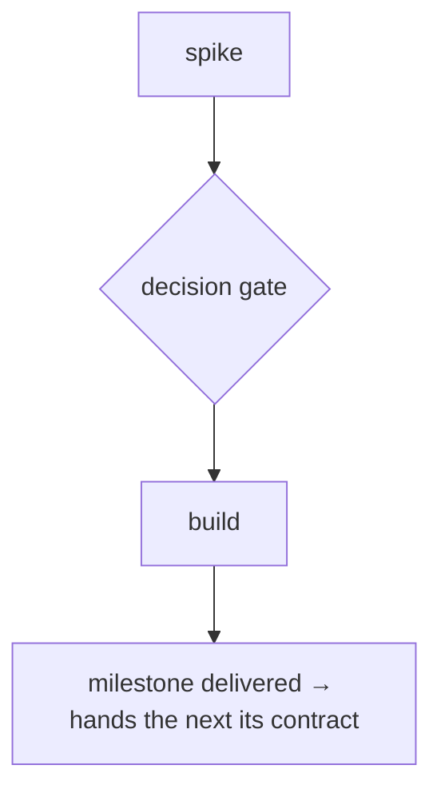
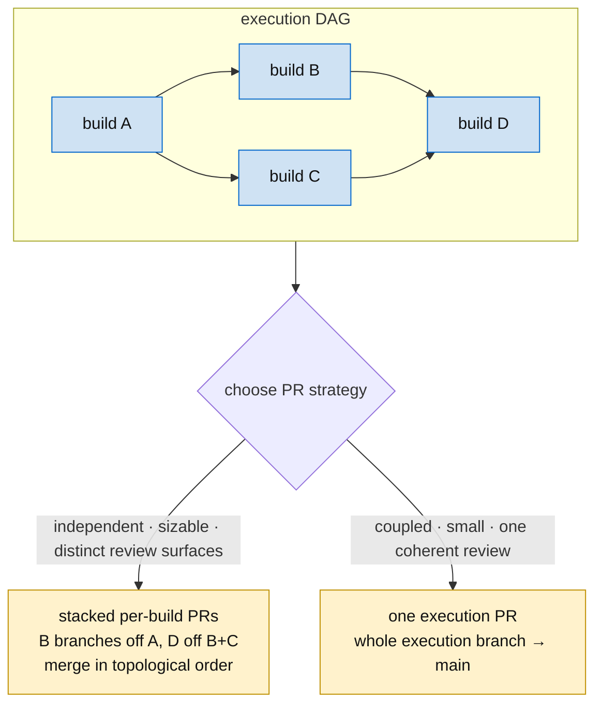

# Execution ticket

The *how/sequence* of a milestone — an **epic that holds the DAG and owns the work as sub-issues** (spikes, builds). One per milestone. Owns the **sequence, not the rationale** (that's the [scope ticket](scope-ticket.md)). Diagram-led — lead with the DAG (see the [diagramming](../diagramming/SKILL.md) skill).

> **Lifecycle:** stays in-progress until the execution *flow is defined* (the spikes have sized the builds), then advances as builds land. Spikes and builds are its sub-issues. See [planning](../planning/SKILL.md) → "Projecting the plan into a live tracker". *This doc is the body format.*

## How execution tickets decompose

Execution tickets plan the work **for subagent execution** — written so an agent can pick it up and run it. They **decompose recursively**: a sub-ticket can itself be an execution ticket. The recursion bottoms out at a **build ticket** — the unit small and self-contained enough that a subagent can do the work *from the ticket alone*.

**The boundary is a test, not a label.** "Small enough for a subagent to do from the ticket alone" is the criterion that *makes* something a build ticket. If a build turns out too complex — it needs breaking up — then it was an execution ticket in disguise: **promote it** (it becomes its own execution ticket) and let its sub-tickets take over the work. Reassess on contact; reclassifying a build *up* to an execution ticket is normal, not a failure.

**An execution ticket encapsulates a deliverable; work lives only in leaves.** If the deliverable is small enough it *is* a single build ticket (a leaf). If it's bigger, it decomposes into build and/or further execution tickets — and an execution ticket that has sub-tickets **holds no work of its own**; it is a pure container. A **build ticket is a leaf — no subtasks, by definition.**

**Walking the tree.** Work proceeds leaf-by-leaf: when a build completes, move *up* the tree and take the **next unstarted build**. To let multiple subagents run concurrently, **mark a build in-progress the moment work on it starts** — so two agents never claim the same leaf (how concurrent results integrate is solved per case for now). Each build **records the branch** its work is on, so the leaf, its diff, and its PR are all reachable from the ticket.

**Structures, not files, define the edges.** Each build declares the **structures it creates** and the **structures it consumes**; a consumed structure must trace to an upstream build's `Provides` — that is what derives the DAG edge. (Two builds that merely edit the same *file* is a merge concern, not a dependency.) A consumed-but-unproduced structure is a **missing root**: add a build that constructs it as early as possible and fan the consumers out from it — type-first.

**Pin the facts.** While painting how the implementation goes, surface the **open questions** and the **load-bearing facts**. Every load-bearing fact must be pinned to reality — a GitHub permalink, a dependency on a prior ticket's output, or a recorded *"we looked and found."* **An unpinned load-bearing fact means the execution still contains a spike** — pin it before the dependent build is started.

## Required sections

- **Execution DAG** — the mermaid: spikes → decision gates → builds → exit.
- **The work** — spikes and builds at a glance, each linked, each a one-line scope. Spikes carry their metric sheet; builds carry **acceptance = the spike's metric sheet**.
- **Decision gates** — the open forks and the evidence that closes them (flip to `DECIDED: …` once resolved, naming the evidence).
- **Exit** — the contract this milestone delivers to the next: the milestone's **output contract**, the union of the builds' `## Provides`, distilled. Must match the scope ticket's Interface contract.
- **Completion gate** — the **final task all leaves feed**; the execution ticket isn't done until it passes (the convergence build, or the "all PRs merged" check). Every execution ticket has one.
- **Status** — what's keeping the flow from being fully defined.

## Skeleton

```markdown
*Execution epic — holds the DAG + owns the work. Canonical scope/view: <scope link>.*

## Execution DAG


## The work (high level)
- S1 · <spike> — <link> → defines B1
- B1 · <build> — <link> · branch `<branch>` · in-progress when started (acceptance = S1's metric sheet)
- GATE · <completion gate> — <link> (all builds feed this; gates the ticket's completion)

## Decision gates
- <fork> — resolved by <spike evidence>.  (flip to "DECIDED: <x>" once closed)

## Exit
<the contract handed to the next milestone>

## Status
<what's keeping the flow from being fully defined>
```

## Realizing the DAG as PRs (landing the work)

The DAG isn't only the plan — it's the **merge plan**. Once builds are implemented, the git branch tree mirrors the DAG and landing is a topological walk of it through the review/QA pipeline.



- **Branch topology = the DAG.** A build's dependency edge is a branch-base edge: build B (depends on A) branches off A's branch, not `main`. A finished nested DAG leaves a branch tree, not a flat pile. (Each build records its branch — above.)
- **Choose the PR strategy — recorded on this ticket — by reviewer cognitive load + coupling:**
  - **Stacked per-build PRs** — each build its own PR, merged in topological order. Each PR **links the PR(s) it sits on and the next to merge**, and embeds the execution DAG with the **merge frontier marked** (merged = green · this PR = current · blocked-behind = gray).
  - **One execution PR** — the whole execution branch lands as a single PR; **link the execution ticket only and show its DAG**.
- A build's author-side finish is `Complete` = implemented + PR-open ([SKILL.md](SKILL.md)); the pipeline closes it. Merge order is the DAG's topological order, ending at the **completion gate**.

Worked example: `CMD-1765` (M2a · execution).
