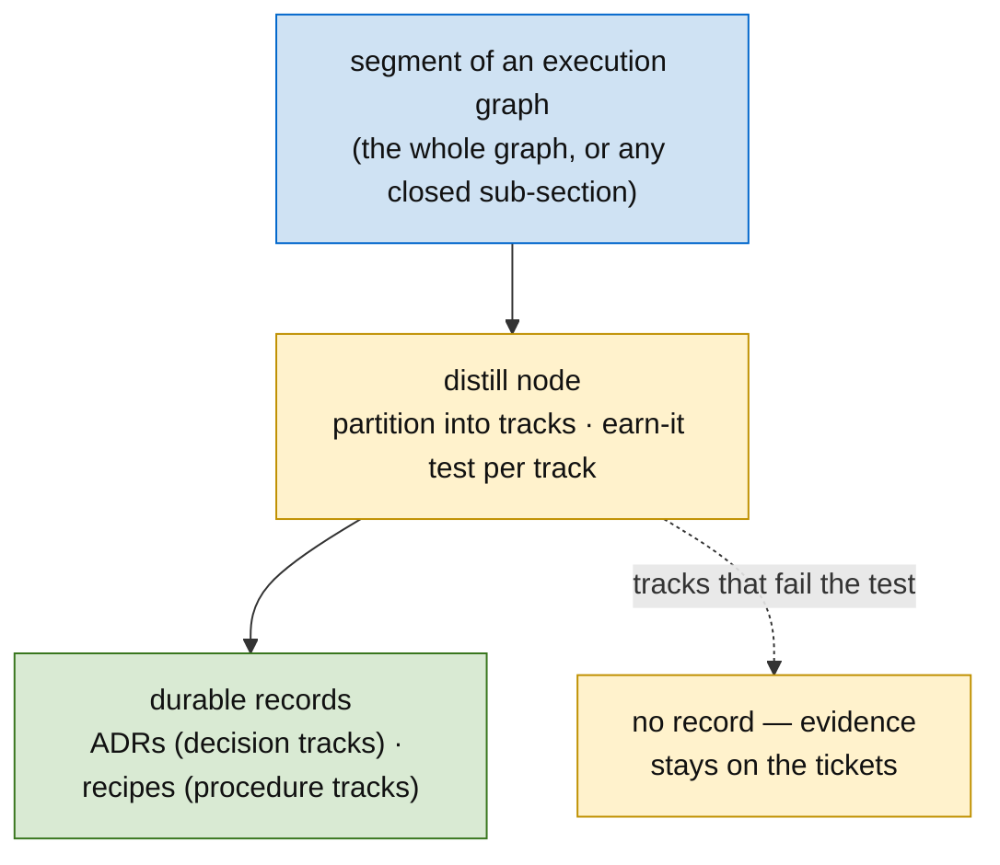
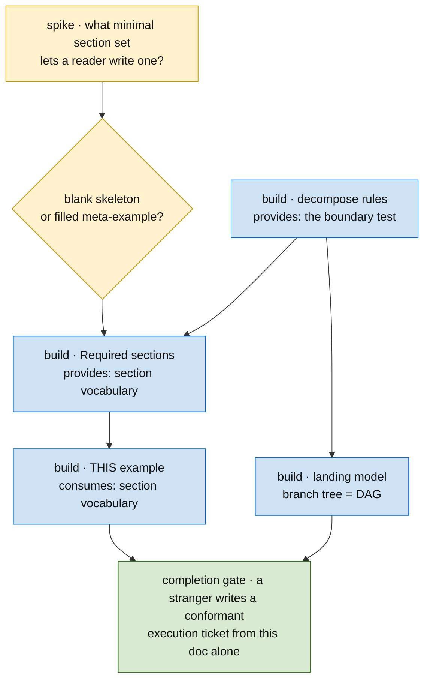
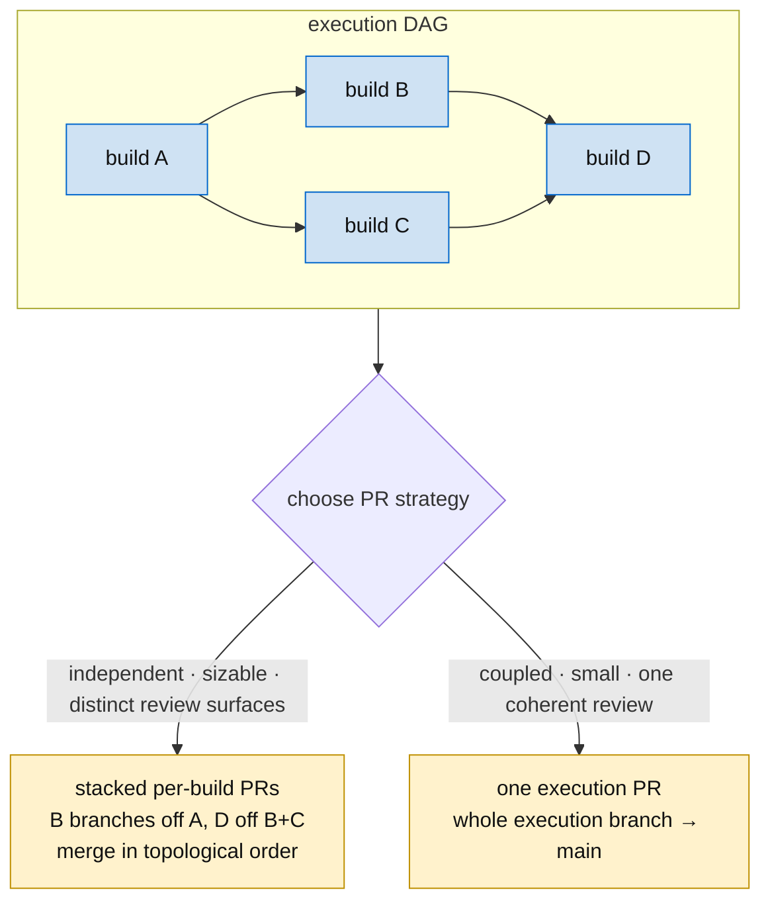

# Execution ticket

The *how/sequence* of a milestone — an **execution ticket that holds the DAG and owns the work as child tickets** (spikes, builds). One per milestone. Owns the **sequence, not the rationale** (that's the [scope ticket](scope-ticket.md)). Diagram-led — lead with the DAG (see the [diagramming](../diagramming/SKILL.md) skill).

> **Lifecycle (lifecycle states):** **Pending** (undecided) → **Ready** (ratified, eligible to start) → **active** (stays here, continuously in progress, *as long as any child ticket is unresolved*) → **done** (goal met + completion gate). **archived** propagates to its child tickets (always with a pointer; never silent). The execution ticket doesn't run the build SDLC as a unit — its builds do — but it may sit in **in review** two ways: *non-critically* when every child ticket is in review (a passive readout), or as a deliberate **human-approval gate** that blocks the execution ticket until a human signs off. See [planning](../planning/SKILL.md) → "The milestone in the tracker". *This doc is the body format; the body is the ticket body, iterated in place.*

## How execution tickets decompose

Execution tickets plan the work **for subagent execution** — written so an agent can pick it up and run it. They **decompose recursively**: a sub-ticket can itself be an execution ticket. The recursion bottoms out at a **build ticket** — the unit small and self-contained enough that a subagent can do the work *from the ticket alone*.

**The boundary is a test, not a label.** "Small enough for a subagent to do from the ticket alone" is the criterion that *makes* something a build ticket. If a build turns out too complex — it needs breaking up — then it was an execution ticket in disguise: **promote it** (it becomes its own execution ticket) and let its sub-tickets take over the work. Reassess on contact; reclassifying a build *up* to an execution ticket is normal, not a failure.

**An execution ticket encapsulates a deliverable; work lives only in leaves.** If the deliverable is small enough it *is* a single build ticket (a leaf). If it's bigger, it decomposes into build and/or further execution tickets — and an execution ticket that has sub-tickets **holds no work of its own**; it is a pure container. A **build ticket is a leaf — no subtasks, by definition.**

**Walking the tree.** Work proceeds leaf-by-leaf: when a build completes, move *up* the tree and take the **next unstarted build**. To let multiple subagents run concurrently, **mark a build in-progress the moment work on it starts** — so two agents never claim the same leaf (how concurrent results integrate is solved per case for now). Each build **records the branch** its work is on, so the leaf, its diff, and its PR are all reachable from the ticket.

**Contracts, not files, define the edges.** Each build declares the **contracts it creates** and the **contracts it consumes** — a type at the leaf, an API or capability higher up. A consumed contract must trace to an upstream build's `Provides` — that is what derives the DAG edge. (Two builds that merely edit the same *file* is a merge concern, not a dependency.) A consumed-but-unproduced contract is a **missing root** — resolve it one of two ways: **extract** it as its own early build and fan the consumers out from it, **or fold** it into the consumer that is its natural owner and re-stack the others onto that build. At the build leaf this is type-first; above, it's the same move over an API or capability.

**Pin the facts.** While painting how the implementation goes, surface the **open questions** and the **load-bearing facts**. Every load-bearing fact must be pinned to reality — a GitHub permalink, a dependency on a prior ticket's output, or a recorded *"we looked and found."* **An unpinned load-bearing fact means the execution still contains a spike** — pin it before the dependent build is started.

## Distill nodes — durable records are ticketed work

Most nodes consume and produce *code contracts*. A **distill node** is the special kind whose input is a **segment of an execution graph** itself: it partitions the segment into **tracks** — each track a path through the DAG telling one story (a spike, the decision gate its evidence closed, the builds that carried it out, any corrective builds a review added) — runs the earn-it test per track, and its `Provides` is the durable records that survive ([methodology](../methodology/SKILL.md) → "Durable records").

**When it runs:** it *can* run at any point in the methodology, but its home is **within execution — and always before the execution is concluded complete**:

- **Mid-execution (segment-scoped).** Any closed sub-section of the graph — a finished track, a decision gate that just resolved — can be distilled while the evidence is fresh, without waiting for the whole execution ticket.
- **Before the completion gate (whole-graph).** The execution is **not concluded complete** until a distill pass has run over its full graph: ADRs for the decision tracks that pass the earn-it test, recipes ([recipe](../recipe/SKILL.md)) for the recurring tracks whose path was non-obvious.

Scoping does **not** run this pass — the next scope *consumes* the records it left (the glossary + ADRs come in as grilling's rubric, [grill](../grill/SKILL.md)). This is the no-unticketed-work rule applied to documentation: distillation appears **in the DAG as a node**, with its input segment named — never as an offline ritual someone may or may not remember.

**Worked example** (tracks of a finished execution ticket, judged): the track *resolution spike → boundary decision gate → two corrective builds* tells one decision story — identity resolves at one service's boundary and the graph node carries only the canonical id. Hard to reverse, surprising, real alternative (resolve it in the consuming service) → **ADR**. The track *add the column → expose the read-seam* is the obvious path with no rival — fails the test → no record; its evidence stays on the tickets. One ADR from four builds: the pass distills *tracks*, it doesn't transcribe the DAG.

## Plan nodes — ticket creation is DAG work

When later builds can't be contracted yet — their shape conditions on an upstream contract that isn't ratified — don't pre-mint vague tickets and don't leave the gap as prose in `## Status`. Insert a **plan node**: a node whose `Consumes` is the ratified upstream contract (or spike evidence) and whose `Provides` is **the next tranche of child tickets**, created and ratified in one pass. Un-ticketed mermaid nodes render as ghosts (gray) until their plan node runs; an execution with ghost nodes and *no* plan node saying when they become real carries an unstated edge. Planning happens in dependency order too — the DAG should show it.

## Required sections

- **Execution DAG** — the mermaid: spikes → decision gates → builds → exit.
- **The work** — spikes and builds at a glance, each linked, each a one-line scope. Spikes carry their metric sheet; builds carry **acceptance = the spike's metric sheet**.
- **Decision gates** — the open forks and the evidence that closes them (flip to `DECIDED: …` once resolved, naming the evidence).
- **Exit** — the contract this milestone delivers to the next: the milestone's **output contract**, the union of the builds' `## Provides`, distilled. Must match the scope ticket's Interface contract.
- **Completion gate** — the **final task all leaves feed**; the execution ticket isn't done until it passes (the convergence build, or the "all PRs merged" check). Every execution ticket has one. It also **verifies the structural contract held**: no two branches define the same structure, and every `Consumes` resolved to its `Provides` — the detective complement to type-first planning, robust to the realistic case where up-front enumeration was imperfect.
- **Status** — what's keeping the flow from being fully defined.

## The DAG is live — propagate every structural change onto the parent (requirement)

The execution ticket **is** the source of truth for the DAG, and the DAG must never lag the work. Any change to the set of leaves — **adding** a build (a review or spike surfaced a new one), **removing/superseding** one, **re-sequencing** an edge, or **promoting** a build to its own execution ticket — is **not complete until it is propagated onto this ticket in the same unit of work**. A sub-build that exists in the tracker but not in the parent's DAG is an **unstated edge** — the same failure `Provides`/`Consumes` guards against, one level up — and it silently makes the execution ticket read done while work is missing.

When a new build is created under an execution ticket, propagation means, on the parent:

1. **Execution DAG** — add the node with its real dependency edges (its depends-on → inbound, its depended-on-by → outbound); apply transitive reduction so the new node sits *in* the path, not beside it.
2. **The work** — add its one-line scope, linked, with its `Provides`/`Consumes` traced to the builds it sits between.
3. **Decision gates** — if a decision sized it, flip that gate to `DECIDED: …` naming the evidence (e.g. the review/spike that surfaced it).
4. **Exit / Completion gate** — re-confirm it still holds: a new leaf must feed the gate, and the Exit contract is still the union of the builds' `Provides`.

This is **part of creating (or removing) the sub-build, not a follow-up task** — the parent's DAG and its children never diverge, so anyone reading the execution ticket cold sees the true shape. The removal/supersession direction of this same rule (strike the node, collapse the DAG, carry the *why* into the survivor) is in [planning](../planning/SKILL.md) → "When built work is removed or superseded"; this section is its general, every-direction statement. Worked instance: a concurrency-guard build surfaced straight from a PR review, and the parent's DAG, work list, and decision gates were updated in the same pass that created it.

## This skill, as an execution ticket

The format explains itself best by *being* an instance. Below is the execution ticket that produced **this very doc** — every required section filled, its subject the doc you're reading. (Want a blank skeleton? It's this, with the values cleared.)

---

*Execution ticket — holds the DAG + owns the work. Canonical scope/view: this doc (the execution-ticket skill).*

**Execution DAG**

**The work**

- `S1` · spike — what is the *minimal* set of sections a reader needs to produce a conformant ticket? → sized the builds. **Result:** six (DAG · work · decision gates · exit · completion gate · status).
- `RULES` · build — the **decompose rules** (boundary-is-a-test, contracts-define-edges, pin-every-fact). *Provides:* the boundary test the rest lean on.
- `REF` · build — the **Required sections** reference. *Consumes:* `RULES`. *Provides:* the section vocabulary. (acceptance = six sections, each named with its purpose)
- `META` · build — **this example**, the format demonstrating itself. *Consumes:* `REF`'s vocabulary. (acceptance = every required section present, filled, subject = this doc)
- `LAND` · build — the **landing** model (branch tree mirrors the DAG; stacked-PRs vs. one-PR).
- `GATE` · completion — all leaves feed it: a reader who's never seen the format can write one **from this doc alone** (the two-stranger test).

**Decision gates**

- *Blank skeleton, or a filled meta-example?* — **DECIDED: meta-example.** A filled instance teaches better than an empty template, and a self-referential one proves the format can carry its own explanation.

**Exit**

The contract handed onward: **a reader can author a conformant execution ticket** — right sections, a real DAG, contracts on the edges, a completion gate. Every downstream [build ticket](SKILL.md) consumes this.

**Status**

**Realized** — the build leaves above are merged; you're reading their output. (An execution ticket sits **active** until its leaves land; this one's have, so it's **done**.)

---

## Realizing the DAG as PRs (landing the work)

The DAG isn't only the plan — it's the **merge plan**. Once builds are implemented, the git branch tree mirrors the DAG and landing is a topological walk of it through the review/QA pipeline.

- **Branch topology = the DAG.** A build's dependency edge is a branch-base edge: build B (depends on A) branches off A's branch, not `main`. A finished nested DAG leaves a branch tree, not a flat pile. (Each build records its branch — above.)
- **Choose the PR strategy — recorded on this ticket — by reviewer cognitive load + coupling:**
  - **Stacked per-build PRs** — each build its own PR, merged in topological order. Each PR **links the PR(s) it sits on and the next to merge**, and embeds the execution DAG with the **merge frontier marked** (merged = green · this PR = current · blocked-behind = gray).
  - **One execution PR** — the whole execution branch lands as a single PR; **link the execution ticket only and show its DAG**.
- A build's author-side finish is **in review** = implemented + change open ([SKILL.md](SKILL.md)); the pipeline closes it. Merge order is the DAG's topological order, ending at the **completion gate**.
